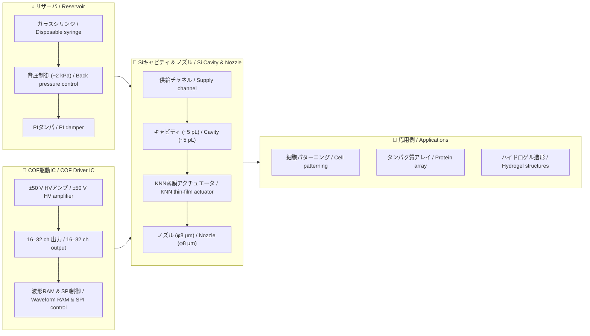

---

# 🧬 生体インクジェット技術 (Bio-Inkjet)  
*Bio-Compatible Inkjet Printing with Lead-free Piezoelectrics*

このディレクトリでは、**鉛フリー圧電材料 (KNN, ScAlN)** を用いた  
**生体適用インクジェット (Bio-IJ)** の仮想モデルを整理します。  
インクシステム・駆動IC・キャビティ形成・ノズル設計などを  
モジュールごとに分けてまとめ、**教育・研究・応用開発**に役立つ知識基盤を構築します。  

*This directory organizes a **virtual model of bio-compatible inkjet (Bio-IJ)**  
based on **lead-free piezoelectric materials (KNN, ScAlN)**.  
It covers ink system, driver IC, Si cavity formation, nozzle design, and more,  
structured as modules for **education, research, and applied development**.*

---

## 📑 コンテンツ構成 / *Contents*

- [⚙️ 材料と圧電デバイス (KNN/ScAlN) / *Materials & Piezo Devices*](bio_knn_device.md)  
- [🔬 Siキャビティとノズル形成 / *Si Cavity & Nozzle Formation*](bio_si_cavity.md)  
- [🔌 COF駆動ICと配線仕様 / *COF Driver IC & Interconnects*](bio_cof_driver.md)  
- [💧 リザーバ・背圧・PIダンパ / *Reservoir, Back Pressure & PI Damper*](bio_reservoir.md)  
- [🧬 応用例：バイオプリンティング / *Applications: Bioprinting*](bio_applications.md)  

---

## 🎯 目的と特徴 / *Objectives & Features*

| 項目 | 日本語 / *Japanese* | 英語 / *English* |
|------|------------------|------------------|
| **材料** | 鉛フリー (KNN, ScAlN) による環境・生体適合性 | **Lead-free** materials ensure environmental & bio-compatibility |
| **性能** | **ほどほどのひずみ性能**で細胞・タンパク質を安全に扱う | **Moderate strain performance** sufficient for safe cell & protein handling |
| **構造** | MEMS技術 (Siキャビティ, 薄膜形成) の応用 | Application of **MEMS technologies** (Si cavity, thin films) |
| **駆動** | COF実装・駆動ICによる多ch駆動 | **COF-packaged driver ICs** for multi-channel actuation |
| **流体制御** | 背圧・ダンパ・脱気を組み込んだ安定吐出 | Stable jetting via **back pressure, damper, degassing** |

---

## 🌐 用途イメージ / *Application Scenarios*

- 🧩 **バイオ3Dプリンティング** / *Bio 3D Printing*  
- 🧫 **細胞・タンパク質の高精度パターニング** / *High-precision cell & protein patterning*  
- 🧪 **マイクロアレイ作製・ドラッグスクリーン** / *Microarray & drug screening*  
- 📚 **教育教材**：MEMS × 圧電 × 流体制御の統合事例 / *Teaching model integrating MEMS, piezo, and fluidics*  

---

## 🗂 システム構成図 / *System Architecture*

