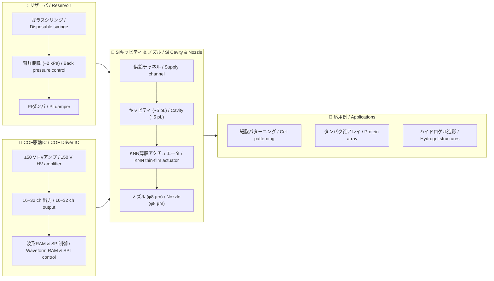

# 🧬 生体インクジェット技術 (Bio-Inkjet)  
*Bio-Compatible Inkjet Printing with Lead-free Piezoelectrics*

このディレクトリは、**教材用ポータル**として構成されています。  
鉛フリー圧電材料 (KNN, ScAlN) を用いた **生体適用インクジェット (Bio-IJ)** の  
仮想モデルを整理し、**教育・研究・応用開発**に役立つ知識基盤を提供します。  

> 💡 **Note**: 本ページは教育教材を主目的とし、研究論文ドラフトPDFは「参考資料」として同梱しています。

---

## 📑 コンテンツ一覧 / *Contents*

- [⚙️ 材料と圧電デバイス (KNN/ScAlN)](bio_knn_device.md)  
- [🔬 Siキャビティとノズル形成](bio_si_cavity.md)  
- [🔌 COF駆動ICと配線仕様](bio_cof_driver.md)  
- [💧 リザーバ・背圧・PIダンパ](bio_reservoir.md)  
- [🧬 応用例：バイオプリンティング](bio_applications.md)  
- [📐 プロセスフロー (Bulk KNN)](process_flow_bulkKNN.md)  

---

## 🎯 教材の目的と特徴 / *Objectives & Features*

| 項目 | 日本語 / *Japanese* | 英語 / *English* |
|------|------------------|------------------|
| **材料** | 鉛フリー (KNN, ScAlN) による環境・生体適合性 | **Lead-free** materials ensure environmental & bio-compatibility |
| **性能** | **ほどほどのひずみ性能**で細胞・タンパク質を安全に扱う | **Moderate strain performance** sufficient for safe cell & protein handling |
| **構造** | MEMS技術 (Siキャビティ, 薄膜形成) の応用 | Application of **MEMS technologies** (Si cavity, thin films) |
| **駆動** | COF実装・駆動ICによる多ch駆動 | **COF-packaged driver ICs** for multi-channel actuation |
| **流体制御** | 背圧・ダンパ・脱気を組み込んだ安定吐出 | Stable jetting via **back pressure, damper, degassing** |

---

## ⚡ 自己診断・適応制御 / *Self-Diagnosis & Adaptive Control*

鉛フリー圧電アクチュエータ (KNN) は、駆動電流や電荷応答を  
**センサー代替**として利用できる特性を持っています。  
これにより、以下のような自己診断・適応制御が可能です：

- **ドット抜け検出**：電荷・変位シグネチャから未吐出を検出し、隣接ノズルで補償  
- **粘度推定**：応答速度の変化からインク粘度を推定し、駆動電圧をフィードバック  
- **適応制御**：PIDゲインやFSM制御モードをリアルタイムで更新し、安定吐出を維持  

> 🧪 詳細な数式モデルや制御アルゴリズムは研究ドラフトPDFに掲載しています。

---

## 🌐 用途イメージ / *Application Scenarios*

- 🧩 **バイオ3Dプリンティング** / *Bio 3D Printing*  
- 🧫 **細胞・タンパク質の高精度パターニング** / *High-precision cell & protein patterning*  
- 🧪 **マイクロアレイ作製・ドラッグスクリーン** / *Microarray & drug screening*  
- 📚 **教育教材**：MEMS × 圧電 × 流体制御の統合事例 / *Teaching model integrating MEMS, piezo, and fluidics*  

---

## 🗂 システム構成図 / *System Architecture*

---

## 📄 研究ドラフト (参考資料) / *Research Draft (For Reference)*

- [📄 Bio-Inkjet Paper (PDF)](bioinkjet_knn.pdf)  
  *Lead-free Bio-Inkjet Printing with Bulk KNN Actuators and AITL-based Adaptive Control*
