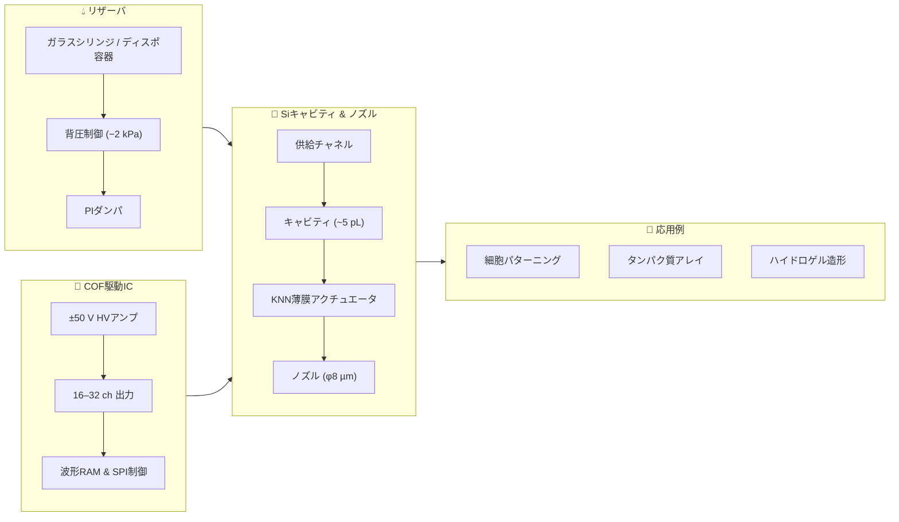

# 🧬 生体インクジェット技術 (Bio-Inkjet)

このディレクトリでは、**鉛フリー圧電材料 (KNN, ScAlN)** を用いた  
**生体適用インクジェット (Bio-IJ)** の仮想モデルを整理します。  
インクシステム・駆動IC・キャビティ形成・ノズル設計などを  
モジュールごとに分けてまとめ、**教育・研究・応用開発**に役立つ知識基盤を構築します。

---

## 📑 コンテンツ構成

- [材料と圧電デバイス (KNN/ScAlN)](bio_knn_device.md)  
- [Siキャビティとノズル形成](bio_si_cavity.md)  
- [COF駆動ICと配線仕様](bio_cof_driver.md)  
- [リザーバ・背圧・PIダンパ](bio_reservoir.md)  
- [応用例：バイオプリンティング](bio_applications.md)  

---

## 🎯 目的と特徴
- **鉛フリー材料**による環境・生体適合性  
- **ほどほどのひずみ性能**で安全に細胞・タンパクを扱う設計思想  
- **MEMS技術 (Siキャビティ, 薄膜形成)** の応用  
- **COF実装・駆動IC**による多ch駆動の現実解  
- **流体制御 (背圧, ダンパ, 脱気)** を組み込んだ安定吐出モデル  

---

## 🌐 用途イメージ
- バイオ3Dプリンティング  
- 細胞・タンパク質の高精度パターニング  
- マイクロアレイ作製、ドラッグスクリーン  
- 教育教材としての MEMS × 圧電 × 流体制御 の統合事例

---

## 🗂 システム構成図

