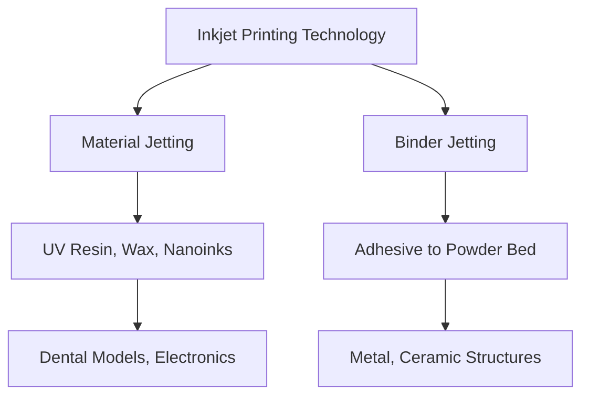

---

# 3Dプリンティング技術の分類とインクジェット方式の位置付け  
# Classification of 3D Printing Technologies and Inkjet Positioning

本ドキュメントでは、ASTM規格に基づく3Dプリンティング技術（AM技術）の公式分類と、インクジェット方式が関与する主な技術を整理します。  
This document organizes the official classification of 3D printing (AM) technologies based on ASTM standards and clarifies the main technologies where inkjet plays a role.  

方式ごとの原理・材料・代表用途を対応させ、**InkjetとAdditive Manufacturingの接点**を明確にします。  
By linking each method with its principle, materials, and representative applications, we clarify the **connection between Inkjet and Additive Manufacturing**.  

---

## 🧭 1. ASTM分類とインクジェット対応マップ  
## 1. ASTM Classification and Inkjet Mapping

| **ASTM分類名 / ASTM Category** | **技術概要 / Technology Overview**          | **インクジェットとの関係 / Relation to Inkjet** |
|--------------------------------|----------------------------------------------|-----------------------------------|
| 1. Material Extrusion          | 熱溶融フィラメント押出（FDM） / Fused Filament Extrusion | 関連なし / Not related |
| 2. Vat Photopolymerization     | レジン槽＋UV照射（SLA, DLP） / Resin bath + UV curing | 間接的（UV硬化材料関連） / Indirect (UV-curable resins) |
| 3. Powder Bed Fusion           | 粉体層＋レーザー／電子ビーム / Powder + laser/e-beam | 関連なし / Not related |
| 4. Binder Jetting              | 粉末にバインダ液を選択吐出 / Selective binder jetting | ✅ 直接関与（ピエゾ） / Directly related (Piezo) |
| 5. Material Jetting            | UV硬化樹脂などを直接積層 / Direct deposition of UV resins, wax | ✅ 直接関与（UV-PJなど） / Directly related (UV-PJ, etc.) |
| 6. Directed Energy Deposition  | 金属ワイヤ＋レーザー加熱 / Metal wire + laser energy | 関連なし / Not related |
| 7. Sheet Lamination            | 接着層＋積層切削 / Laminated sheets + cutting | 関連なし / Not related |

---

## 🧪 2. 各方式の技術比較  
## 2. Comparison of Each Method

| **方式名 / Method**   | **使用材料 / Materials** | **固化方法 / Solidification** | **解像度 / Resolution** | **備考 / Notes** |
|------------------------|---------------------------|-------------------------------|-------------------------|------------------|
| Binder Jetting         | 粉体＋接着液 / Powder + Binder | 焼結（後処理） / Sintering (post-process) | 100 μm〜 | 金属・セラミック対応 / Suitable for metals and ceramics |
| Material Jetting       | UV樹脂／ワックス / UV resins, wax | UV照射 or 加熱 / UV curing or heating | 16〜50 μm | 多色対応、表面平滑 / Multi-color, smooth surface |
| Inkjet BioPrinting     | 生体細胞懸濁液 / Cell suspensions | ゲル化・自己組織化 / Gelation, self-assembly | 50〜200 μm | バイオ医療応用 / Biomedical applications |

---

## 🖨 3. インクジェット構成における位置付け  
## 3. Inkjet Positioning in AM Structure

---

## 📌 4. 代表的装置例と応用用途  
## 4. Representative Systems and Applications

| **メーカー／製品例 / Manufacturer & Product** | **方式 / Method** | **応用分野 / Applications** |
|--------------------------------|-----------------|--------------------------------|
| Stratasys PolyJet              | Material Jetting | 工業試作、歯科模型 / Prototyping, dental models |
| HP Jet Fusion (MJF)            | Binder Jetting + 熱融合 / Binder jetting + thermal fusion | 工業部品、筐体 / Industrial parts, housings |
| Desktop Metal Studio           | Binder Jetting | 金属造形、少量生産 / Metal structures, small lot production |
| 3D Systems Projet              | Material Jetting | デザインモデル、精密試作 / Design models, precise prototypes |
| Organovo ExVive                | Bio Jetting | 組織工学、再生医療 / Tissue engineering, regenerative medicine |

---

## 📚 参考文献 / References

- ASTM F2792-12a: *Standard Terminology for Additive Manufacturing Technologies*  
- Stratasys White Papers  
- HP JetFusion Technology Guide  
- Nature Reviews Materials, Biofabrication Journal  
