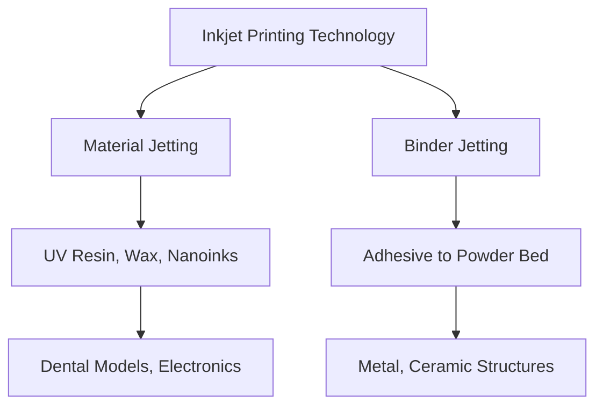

# 3Dプリンティング技術の分類とインクジェット方式の位置付け

本ドキュメントでは、ASTM規格に基づく3Dプリンティング技術（AM技術）の公式分類と、インクジェット方式が関与する主な技術を整理します。  
方式ごとの原理・材料・代表用途を対応させ、**InkjetとAdditive Manufacturingの接点**を明確にします。

---

## 🧭 1. ASTM分類とインクジェット対応マップ

| ASTM分類名                     | 技術概要                                      | インクジェットとの関係     |
|-------------------------------|-----------------------------------------------|----------------------------|
| 1. Material Extrusion         | 熱溶融フィラメント押出（FDM）                 | 関連なし                   |
| 2. Vat Photopolymerization    | レジン槽＋UV照射（SLA、DLP）                  | 間接的（UV硬化材料関連）  |
| 3. Powder Bed Fusion          | 粉体層＋レーザー／電子ビーム（SLS、SLM）      | 関連なし                   |
| 4. Binder Jetting             | 粉末にバインダ液をインクジェットで選択吐出     | ✅ 直接関与（ピエゾ）       |
| 5. Material Jetting           | UV硬化樹脂などをインクジェットで直接積層       | ✅ 直接関与（UV-PJなど）    |
| 6. Directed Energy Deposition| 金属ワイヤ＋レーザー加熱同時供給              | 関連なし                   |
| 7. Sheet Lamination           | 接着層＋積層切削                              | 関連なし                   |

---

## 🧪 2. 各方式の技術比較

| 方式名              | 使用材料             | 硬化／固化方法     | 解像度    | 備考                       |
|---------------------|----------------------|---------------------|-----------|----------------------------|
| Binder Jetting      | 粉体＋接着液         | 焼結（後処理）       | 100μm〜   | 金属／セラミック対応        |
| Material Jetting    | UV樹脂／ワックス     | UV照射 or 加熱       | 16〜50μm  | 多色対応／滑らかな表面     |
| Inkjet BioPrinting  | 生体細胞懸濁液       | 自己組織化／ゲル化等 | 50〜200μm | バイオ医療研究に応用        |

---

## 🖨 3. インクジェット構成における位置付け

---

## 📌 4. 代表的装置例と応用用途

| メーカー・製品例      | 方式                   | 応用分野                              |
|-----------------------|------------------------|---------------------------------------|
| Stratasys PolyJet     | Material Jetting       | 工業試作、マルチマテリアル、歯科模型 |
| HP Jet Fusion (MJF)   | Binder Jetting + 熱融合 | 工業部品、筐体、軽量構造             |
| Desktop Metal Studio  | Binder Jetting         | 金属造形、試作、少量生産             |
| 3D Systems Projet     | Material Jetting       | デザインモデル、精密プロトタイプ     |
| Organovo ExVive       | Bio Jetting            | 組織工学、再生医療                   |

---

## 📚 参考文献

- ASTM F2792-12a: *Standard Terminology for Additive Manufacturing Technologies*  
- Stratasys White Papers  
- HP JetFusion Technology Guide  
- Nature Reviews Materials, Biofabrication Journal  
