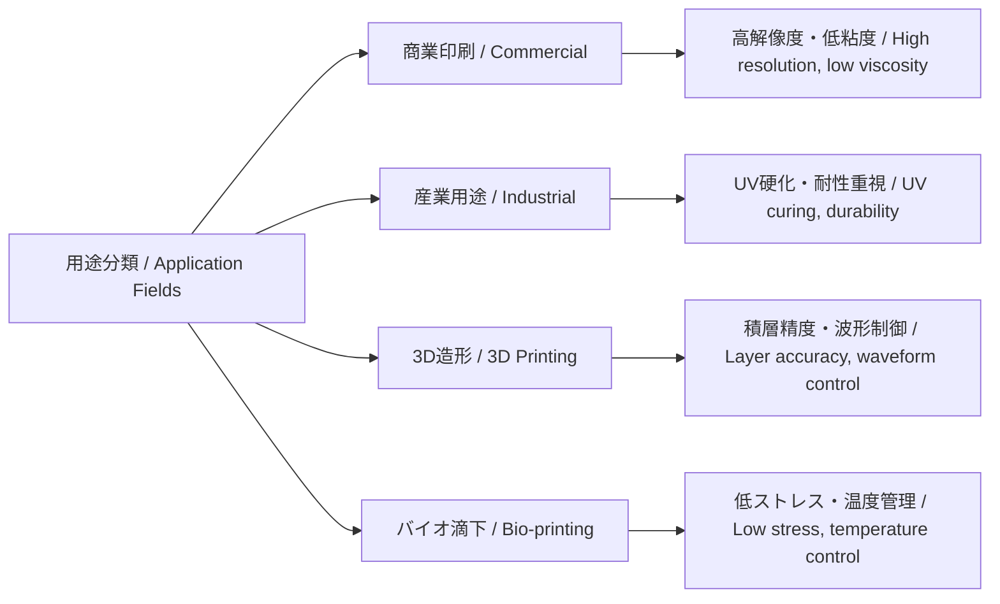

---

# 🎨 **用途別分類とインクジェット技術の応用展開 / Inkjet Usage Fields and Application Domains**

**日本語 / Japanese**  
本章では、インクジェットプリンタ技術の主な用途領域を整理し、それぞれにおける **インク特性／ヘッド要件／構造選定の背景** を比較します。  
多様化する印字対象・材料に応じて、ピエゾ／サーマルの選択や駆動条件が大きく異なってきます。  

**English**  
This section organizes the **application domains of inkjet technology**, comparing **ink properties, head requirements, and structural design choices**.  
Depending on the printing target and material diversity, the choice of **piezo vs. thermal drive** and driving conditions varies significantly.  

---

## 📘 **1. 用途分類マップ / Application Categories**

| **分類 / Field** | **主な対象 / Target** | **使用インク / Ink Type** | **技術的特徴 / Technical Features** |
|------------------|-----------------------|---------------------------|-------------------------------------|
| **商業印刷 / Commercial** | 紙・フォト紙 / Paper, photo media | 染料・顔料 / Dye, pigment | 高解像度・色域・耐光性 |
| **産業印刷 / Industrial** | フィルム・パッケージ / Film, packaging | UV・油性・溶剤 / UV, solvent | 耐擦過・密着性・可搬速度 |
| **テキスタイル / Textile** | 綿・ポリエステル / Cotton, polyester | 顔料・反応染料 / Pigment, reactive dye | 濡れ性・硬化／定着処理 |
| **電子デバイス / Electronics** | ガラス・樹脂基板 / Glass, polymer | 導電性／絶縁性インク / Conductive, insulating | 微細パターン・位置精度・乾燥制御 |
| **バイオ医療 / Bio-medical** | 細胞培養基板 / Cell culture, microplates | バイオ液（細胞,タンパク質） | 滴下精度・低ストレス・非接触 |
| **3Dプリント / 3D Printing** | 粉末／レジン / Powder, resin | UV樹脂・バインダ / UV resin, binder | 積層精度・材料制御・硬化連携 |

---

## 🔍 **2. 用途別に求められるヘッド性能 / Required Head Performance**

| **用途 / Field** | **解像度 / Resolution** | **吐出量 / Drop Volume** | **ノズル構成 / Nozzle Design** | **要求特性 / Key Requirements** |
|------------------|-------------------------|---------------------------|---------------------------------|---------------------------------|
| フォト印刷 / Photo | 1200 dpi〜 | 1〜3 pl | 高密度（300dpi以上） | 高彩度・微細粒子対応 |
| パッケージ印刷 / Packaging | 300〜600 dpi | 5〜15 pl | 耐擦・UV対応 | 粘度変動・搬送速度対応 |
| 布地プリント / Textile | 300〜600 dpi | 10〜30 pl | 中密度 | 濡れ性・定着・耐摩耗 |
| 回路形成 / Circuitry | 600〜1200 dpi | <1 pl | 高精度・温調 | 配線幅・粘度安定・酸化制御 |
| 細胞滴下 / Cell printing | 50〜300 dpi | 数 nL | 低衝撃・非接触 | 生体適合・温度管理 |

---

## 🧠 **3. 技術選定と用途の関係性 / Technology Selection vs Applications**

---

## 🎯 **技術活用上の示唆 / Implications**

- 駆動方式（熱方式 vs ピエゾ方式）は、用途ごとの **インク性状（粘度・表面張力）／温度条件／印字精度** に強く依存する。  
- ヘッド構造や波形設計は、**用途ドリブン設計（application-driven design）** が基本。  
- 各用途では、**インク物性・環境条件**をセットで考慮することで最適な方式マッピングが可能。  
- 高速搬送用途では **高頻度駆動・吐出安定性・ミスト抑制** が重要。  
- バイオ／電子用途では **滴下衝撃や温度応答の影響** まで設計に含める必要がある。  

---

## 📚 **参考文献 / References**

- **Fujifilm Dimatix Jetting Design Guide**  
- **Epson, Canon, Ricoh** 技術紹介資料  
- *Journal of Imaging Science and Technology*, *Biofabrication Journal*  

---

🛠️ Maintained by [Samizo-AITL](https://samizo-aitl.github.io)
