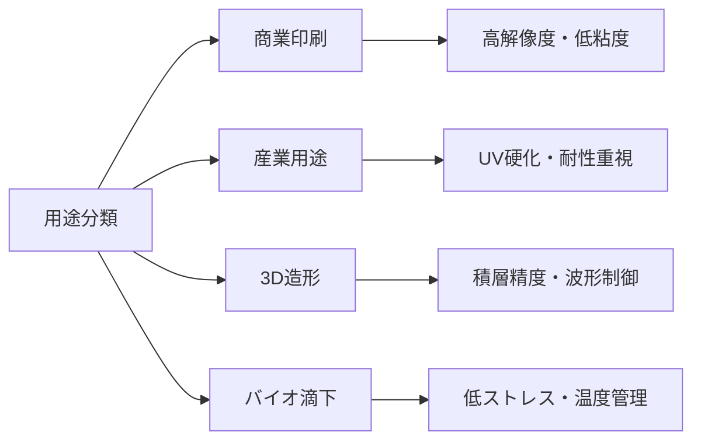

# 用途別分類とインクジェット技術の応用展開 / Inkjet Usage Fields and Application Domains

本章では、インクジェットプリンタ技術の主な用途領域を整理し、それぞれにおける**インク特性／ヘッド要件／構造選定の背景**を比較します。  
多様化する印字対象・材料に応じて、ピエゾ／サーマルの選択や駆動条件が大きく異なってきます。

---

## 📘 1. 用途分類マップ（主要分野）

| 分類            | 主な対象               | 使用インク           | 技術的特徴                        |
|------------------|------------------------|----------------------|-----------------------------------|
| 商業印刷          | 紙／フォト紙            | 染料・顔料インク     | 高解像度・色域・耐光性             |
| 産業印刷          | フィルム・パッケージ    | UV・油性・溶剤       | 耐擦過・密着性・可搬速度           |
| テキスタイル印刷  | 綿・ポリエステルなど    | 顔料・反応染料       | 布地への濡れ性・硬化／定着処理     |
| 電子デバイス      | ガラス・樹脂基板        | 導電性／絶縁性インク | 微細パターン・位置精度・乾燥制御   |
| バイオ医療        | マイクロプレート・細胞培養基板 | バイオ液（細胞、タンパク質） | 滴下精度、非接触、低ストレス     |
| 3Dプリント        | 粉末／レジン            | UV樹脂・バインダ     | 積層精度・材料選定・硬化連携       |

---

## 🔍 2. 用途別に求められるヘッド性能（比較）

| 用途             | 解像度      | 吐出量        | ノズル構成       | 要求特性                  |
|------------------|-------------|---------------|------------------|---------------------------|
| フォト印刷        | 1200dpi〜   | 1〜3 pl        | 高密度（300dpi以上） | 高彩度・微細粒子対応        |
| パッケージ印刷    | 300〜600dpi | 5〜15 pl       | 耐擦・UV対応     | 粘度変動・搬送速度に強い    |
| 布地プリント      | 300〜600dpi | 10〜30 pl      | 中密度           | 耐摩耗・濡れ制御            |
| 回路形成          | 600〜1200dpi| <1 pl（微粒子）| 高精度・温調必要 | 配線幅・粘度安定・酸化制御  |
| 細胞滴下          | 50〜300dpi  | 数nL           | 低衝撃・非接触型 | 生体適合・温度管理           |

---

## 🧠 3. 技術選定と用途の関係性

---

## 🎯 技術活用上の示唆

- 駆動方式（熱方式 vs ピエゾ方式）は、用途ごとの **インク性状（粘度・表面張力）／使用温度／印字精度** に強く影響される。
- ヘッドの構造選定や波形設計は、単なる方式選択ではなく、**用途起点（用途ドリブン）**で設計されるべきである。
- 各用途に対して、**インク物性（粘度・表面張力）／環境条件（温度・湿度）** をセットで整理することで、適切なヘッド・駆動方式のマッピングが可能となる。
- 高速搬送が求められる分野では、**高頻度駆動／吐出安定性／ミスト抑制**が重要課題となる。
- バイオ応用や電子デバイス用途では、**滴下衝撃や温度応答が材料・細胞に与える影響**まで設計に含める必要がある。

---

## 📚 参考文献

- Fujifilm Dimatix Jetting Design Guide  
- Epson, Canon, Ricoh 各社技術紹介資料（一般公開）  
- Journal of Imaging Science and Technology, Biofabrication Journal  

