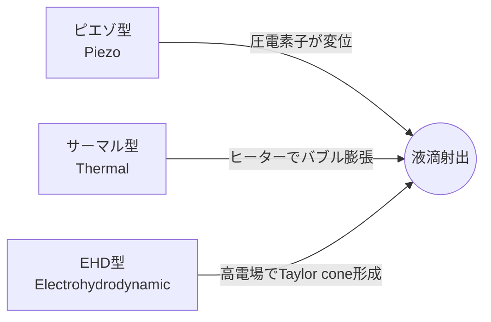

# 2. 駆動方式の原理 / Actuation Principles

## 🔎 駆動方式の分類 / Classification
インクジェットヘッドの駆動方式は、**液滴を生成するためにどのように圧力や力を加えるか**によって分類される。  
代表的な方式は以下の3つである。  
1. ピエゾ型 (Piezoelectric Actuation)  
2. サーマル型 (Thermal/Bubble Jet)  
3. 電場駆動型 (Electrohydrodynamic, EHD)  

---

## 🖼️ 駆動方式の模式図 / Conceptual Diagrams

---

## 1️⃣ ピエゾ型 / Piezoelectric Actuation
### 🧩 原理
- 圧電素子（主に PZT: Pb(Zr,Ti)O₃）に電圧を印加すると、結晶が伸縮する **圧電効果** を利用。  
- この変位によってキャビティ内のインク圧力が変化し、液滴がノズルから射出される。  
- 駆動波形は通常 **数十 V ～ 100 V、数 µs オーダー**。  

### ⚙️ 特徴
- 非加熱方式であるため、**熱に弱いインク（バイオインク、機能性材料）**にも適用可能。  
- 高周波駆動（～100 kHz）が可能で、**産業用高速印刷**に広く使われる。  

### ✅ 利点
- 液滴サイズ制御の自由度が高い（駆動波形設計により最適化可能）。  
- 高い信頼性（数百億ショット以上の寿命）。  
- 多様なインクに対応（高粘度・ナノ粒子インクなど）。  

### ⚠️ 課題
- デバイス構造が複雑（MEMS加工が必要）。  
- 圧電材料に鉛 (Pb) が含まれる場合が多く、環境規制対応が課題。  

### 🎯 主な応用
- 産業用インクジェット印刷（パッケージ、商業印刷）  
- バイオプリンティング（細胞・タンパク質）  
- 機能性材料印刷（導電性インク、光学材料）  

---

## 2️⃣ サーマル型 / Thermal (Bubble Jet)
### 🧩 原理
- ノズル内部に微小ヒーターを設置し、電気パルスで局所的にインクを加熱（～300℃近傍、数 µs）。  
- インクが急激に気化して**バブル（気泡）**を形成し、その膨張圧力で液滴を射出。  
- 駆動電圧は低く、**10～20 V 程度**。  

### ⚙️ 特徴
- 構造がシンプルで製造コストが安い。  
- HP・Canon などの家庭用・オフィス用プリンタで主流。  

### ✅ 利点
- 低電圧駆動、低コストで大量生産に適する。  
- ノズル構造が簡易で、CMOS 集積回路と親和性が高い。  

### ⚠️ 課題
- 高温局所加熱によりインクの化学的性質が変化（色素分解、バイオ分子変性）。  
- インクの種類が制限される（熱安定性が必要）。  
- 信頼性はピエゾに比べて低く、**数十億ショットレベル**。  

### 🎯 主な応用
- 家庭用インクジェットプリンタ  
- 写真印刷用プリンタ  
- 一部の小型産業用途  

---

## 3️⃣ 電場駆動型 / Electrohydrodynamic (EHD)
### 🧩 原理
- ノズル先端に強い電場（数百 V ～ kV）を印加。  
- インク表面に電荷が誘起され、静電力によって**テイラーコーン (Taylor cone)** を形成。  
- 電場により液滴が射出される。  

### ⚙️ 特徴
- 非常に微細な液滴（サブミクロンレベル）を生成可能。  
- 駆動周波数は低速（～数 kHz）。  
- 高電圧が必要で、安定駆動が難しい。  

### ✅ 利点
- 微細パターニングに適し、半導体・ナノ材料応用に強み。  
- 表面張力・粘度の制約が比較的少ない。  

### ⚠️ 課題
- 高電圧駆動による安全性・安定性の課題。  
- ノズル周辺での帯電・スパークのリスク。  
- 産業実用化はまだ初期段階。  

### 🎯 主な応用
- 微細加工・ナノパターニング  
- 高分解能電子デバイス製造  
- 研究用途（実験室レベル）  

---

## 📊 駆動方式の比較 / Comparison Table
| 方式 | 駆動電圧 | 周波数帯域 | 信頼性 | 主な応用 |
|------|----------|------------|--------|----------|
| ピエゾ | 数十 V ～ 100 V | ～100 kHz（高速） | 高い（数百億ショット） | 産業印刷, バイオ, 機能性材料 |
| サーマル | 10 ～ 20 V | ～30 kHz（中速） | 中程度（数十億ショット） | 家庭用プリンタ, 写真印刷 |
| EHD | 数百 V ～ kV | ～数 kHz（低速） | 研究段階 | 微細加工, ナノ材料 |

---

## ✨ 本章のまとめ / Summary
- **ピエゾ型**は高信頼性・多様なインク対応で産業用途の主流。  
- **サーマル型**は低コスト・大量生産に適し、家庭用プリンタに広く普及。  
- **EHD型**は次世代微細加工に有望だが、安定性と安全性の課題が残る。  

インクジェット駆動方式の理解は、**液滴生成物理（第3章）や応用分野（第8章）**への架け橋となる。
