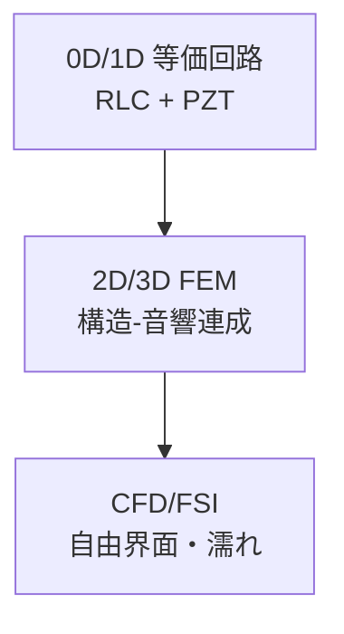
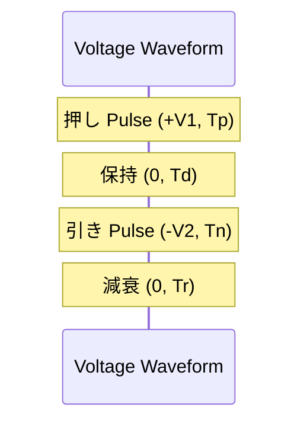
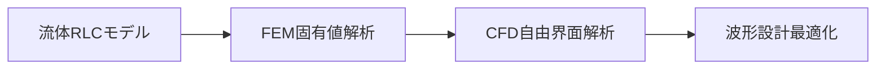

# 7. 設計・解析アプローチ / Design & Analysis

## 🧪 解析手法 / Analysis Methods

### 7.1 モデリングの階層 / Modeling Stack
1. **0D–1D 連成（等価回路/音響線路）**  
   - 目的: 設計初期の感度解析・波形探索。  
   - 表現: 流体系を **R（粘性抵抗）–L（流体慣性）–C（圧縮性）** に置換、PZT を **電気–機械変換器**として結合。  
   - ノズル/流路の流体インピーダンス（周波数領域）  
     $$
     Z_f(\omega) \approx R + j\omega L + \frac{1}{j\omega C}
     $$
   - 音響線路の基本インピーダンス  
     $$
     Z_0=\frac{\rho c}{A},\quad \Gamma=\frac{Z_L-Z_0}{Z_L+Z_0}
     $$
     （$\rho$: 密度, $c$: 音速, $A$: 断面, $Z_L$: 負荷）

2. **2D/3D FEM（構造–電気–音響）**  
   - 目的: 固有値解析（共振/反共振）、変位分布、キャビティ圧応答。  
   - 境界: PZT–電極に電位境界、流体側は音響境界/等価剛性で近似。  
   - 典型: PZT厚 10–40 µm、固有周波数 数十–数百 kHz。

3. **CFD/FSI（自由界面・濡れ）**  
   - 目的: メニスカス運動～ジェット化～分裂～着弾の予測。  
   - 手法: ALE/Level-Set/VOF（接触角・張力・接触角ヒステリシスを考慮）。  
   - 注意: 時間刻みは **表面張力キャップ時間**と **音速による最小時間刻み**に制約。

> 実務では **0D/1D→FEM→FSI** の段階最適化が有効（計算資源の節約と設計勾配の獲得）。

---

### 7.2 メッシュ・境界・数値安定 / Meshing & BC
- **流体**: ノズル径 $D$ に対しメッシュサイズ $\le D/20$、自由界面付近は $\le D/50$。  
- **時間刻み**: キャップ波速度 $c_\sigma=\sqrt{\sigma/(\rho D)}$ を用いて $\Delta t \lesssim 0.1\,D/c_\sigma$。  
- **接触角**: 進入/後退角を分離（例：$80^\circ/110^\circ$）。  
- **圧縮性**: キャビティは水でも有限圧縮性を考慮（$C\_fluid\sim V/\kappa$）。  
- **安定化**: 高We/低Oh 条件で界面拡散（Level-Set リイニシャライズ間隔の最適化）。

---

### 7.3 パラメタ同定 / Parameter Identification
- **静電容量 $C\_{act}$**（数十～数百 pF/ノズル）：LCR測定→波形電流ピーク整合。  
- **流体 RLC**：ステップ応答の立上り/リンギングから逆推定（Prony 分解）。  
- **界面特性**：ドロップウォッチの初速度・体積–波形の回帰で実効接触角/張力補正。

---

## 📈 波形設計 / Drive Waveform Design

### 7.4 バイポーラ/マルチパルス設計指針
- **基本形**（押し→保持→引き→減衰）  

# 7. 設計・解析アプローチ / Design & Analysis

## 🧪 解析手法 / Analysis Methods

### 7.1 モデリングの階層 / Modeling Stack

1. **0D–1D 等価回路**  
   - 流体を $RLC$ モデル化、PZT を電気-機械変換器で接続。  
   - 流体インピーダンス  
     $$
     Z_f(\omega) \approx R + j\omega L + \frac{1}{j\omega C}
     $$
   - 音響線路インピーダンス  
     $$
     Z_0=\frac{\rho c}{A},\quad \Gamma=\frac{Z_L-Z_0}{Z_L+Z_0}
     $$

2. **2D/3D FEM**  
   - 固有値解析（共振/反共振）、変位分布、キャビティ圧応答。  

3. **CFD/FSI**  
   - 自由界面追跡（Level-Set/VOF）。  
   - ジェット化～分裂～着弾まで解析。  

---

### 7.2 メッシュ・境界条件 / Meshing & BC

| 項目 | 設計指針 |
|------|----------|
| メッシュ | $D/20$ 以下（自由界面は $D/50$） |
| 時間刻み | $\Delta t \lesssim 0.1\,D/c_\sigma$ |
| 接触角 | 進入/後退角を分離（例：80°/110°） |
| 圧縮性 | キャビティ有限圧縮性を考慮 |
| 安定化 | Level-Set のリイニシャライズ間隔最適化 |

---

### 7.3 パラメタ同定 / Parameter Identification

- **静電容量 $C_{act}$**：LCR測定で同定。  
- **流体系RLC**：ステップ応答 → Prony分解。  
- **界面特性**：ドロップウォッチから波形–液滴速度の回帰。  

---

## 📈 波形設計 / Drive Waveform Design

### 7.4 バイポーラ/マルチパルス設計指針

- **押し (Push)**: 液柱形成  
- **保持 (Dwell)**: 圧力安定化  
- **引き (Pull)**: メニスカス復元、サテライト抑制  
- **減衰 (Damp)**: リンギング抑制  

---

### 7.5 設計と解析の関係 / Workflow

---

## ✨ 本章のまとめ / Summary
- 設計は **0D/1D → FEM → CFD/FSI** の多階層最適化が有効。  
- 波形設計では **バイポーラ/マルチパルス**により液滴径・速度・安定性を制御。  
- メッシュ分解能、時間刻み、界面条件の設定が解析精度を支配する。  
