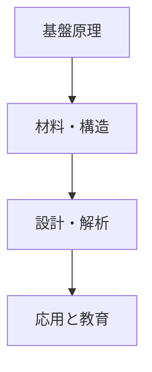
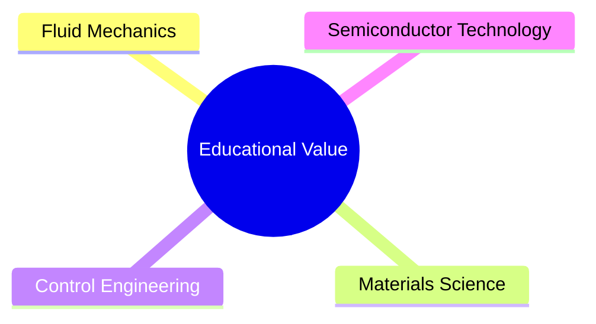
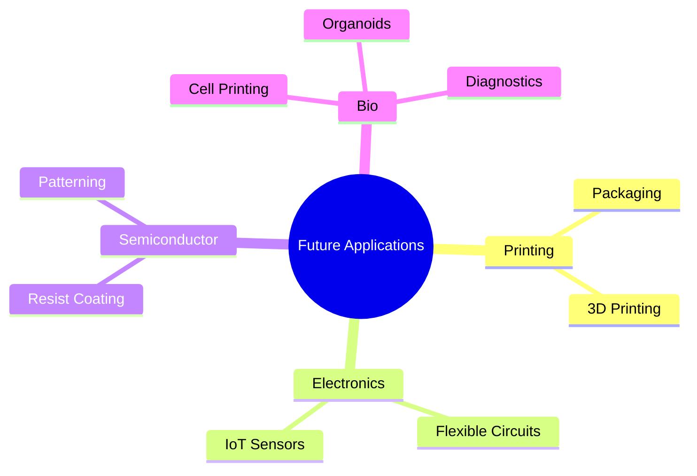

# 10. 結論 / Conclusion

## 📚 技術体系の総まとめ / Summary of the Inkjet Technology Framework
本チュートリアルでは、インクジェット技術を以下の流れで体系的に整理した。  

1. **基盤原理**  
   - 駆動方式（ピエゾ・サーマル・EHD）  
   - 液滴形成の物理（レイリー–プラトー不安定性、無次元数解析）  

2. **材料・構造**  
   - インクの分類（染料系、顔料系、バイオインク、導電性インク）  
   - インクシステム（カートリッジ、フィルタ、デガス、循環）  
   - デバイス構造（ノズル・キャビティ、圧電材料、CMOS 集積）  

3. **設計・解析**  
   - FEM、CFD を活用した電気–機械–流体の連成解析  
   - 波形設計による液滴径・速度制御  
   - 信頼性課題（疲労、詰まり、気泡）の検討  

4. **応用と教育**  
   - 印刷、半導体、バイオ応用への展開  
   - 教育的価値：流体・材料・制御・半導体を横断する教材性  

---

## 🎓 教育的意義 / Educational Insights
- インクジェットは、単なる印刷技術を超えた「**学際的教育プラットフォーム**」として活用できる。  
- **流体力学**（無次元数、液滴形成）、**材料科学**（インク組成・圧電材料）、**制御工学**（駆動波形・圧力制御）、**半導体工学**（MEMS/CMOS 集積）を一貫して学習可能。  
- 大学教育から産業研修まで、理論と実験を統合した教材として有用。  

---

## 🔭 今後の展望 / Future Perspectives

### 1. 産業分野
- **印刷**: パッケージ、商業印刷、3D プリントへの更なる拡張。  
- **エレクトロニクス**: プリント配線、フレキシブルデバイス、IoT センサー。  
- **半導体**: レジスト塗布補助、局所パターニング、低コストプロセス統合。  
- **バイオ**: 細胞プリンティング、オルガノイド、診断用マイクロアレイ。  

### 2. 技術課題
- **環境対応**: Pbフリー圧電材料の実用化、低環境負荷インク設計。  
- **低電圧化・高効率化**: モバイル・ウェアラブル応用に向けた消費電力削減。  
- **高信頼性化**: ノズル寿命、詰まり対策、気泡制御、長期安定性の確保。  

### 3. 学際研究
- 流体×材料×制御×バイオのクロス領域研究が加速。  
- シミュレーションと実験を統合した「**デジタルツイン**」的設計手法が普及。  
- AI/機械学習による駆動波形最適化や故障予兆検知。  

---

## ✨ 最終メッセージ / Final Message
インクジェット技術は、**微小液滴制御**というシンプルな原理に基づきながら、  
**印刷・半導体・バイオ・教育**といった多岐にわたる分野に応用可能な「プラットフォーム技術」である。  

本チュートリアルを通じて、学生・研究者・技術者がその基礎から応用、そして未来の研究テーマまで一貫して理解し、  
**次世代の学際研究と産業イノベーションを牽引する力**となることを期待する。  

# 10. 結論 / Conclusion

---

## 📚 技術体系の総まとめ / Summary of the Inkjet Technology Framework



1. **基盤原理**: 駆動方式、液滴形成物理  
2. **材料・構造**: インク分類、インクシステム、ノズル/PZT/CMOS 集積  
3. **設計・解析**: FEM, CFD, 波形設計、信頼性解析  
4. **応用と教育**: 印刷、半導体、バイオ、学際教育  

---

## 🎓 教育的意義 / Educational Insights



- **流体**: 無次元数、液滴安定性  
- **材料**: インク物性、圧電材料  
- **制御**: 波形設計、圧力・温度制御  
- **半導体**: MEMS ノズル、CMOS 集積  

---

## 🔭 今後の展望 / Future Perspectives

### 応用分野の広がり


### 技術課題
- Pbフリー材料、低電圧駆動、高信頼性化。  
- AI/デジタルツインによる設計最適化。  

---

## ✨ 最終メッセージ / Final Message

```mermaid
quote
  "Inkjet = Microdroplet Control → Cross-Disciplinary Platform"
```

インクジェットは **微小液滴制御**という単純な原理に基づきながら、  
**印刷・半導体・バイオ・教育**にまたがる **プラットフォーム技術** へと進化している。  

本チュートリアルを通じて、読者が基礎から応用・未来課題まで理解し、  
**次世代の学際研究と産業イノベーションを牽引する力**となることを期待する。  
