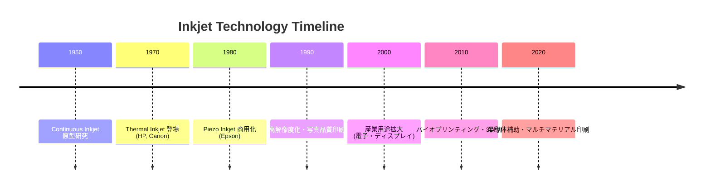

# 1. 序論 / Introduction

## 📜 背景 / Background
インクジェット技術は、1970年代にプリンタ用途として商用化され、その後の数十年で急速に発展した。  
初期は家庭用・オフィス用プリンタを中心に発展し、**高解像度・低コスト印刷**を実現したことから広く普及した。  
1990年代以降、産業用途に拡張され、**電子デバイス製造・ディスプレイ・半導体補助プロセス**などの分野に応用が広がっている。  
さらに21世紀に入ると、**バイオプリンティング**（細胞・タンパク質の配置、ドラッグスクリーニング）や**アディティブマニュファクチャリング**（3Dプリント）にも利用され、学際的技術として位置づけられるようになった。

---

## 🕰️ インクジェットの歴史と進化 / History and Evolution

---

## 🏭 教育的・産業的意義 / Educational and Industrial Significance
1. **教育的意義**
   - 流体力学（微小液滴のジェット形成、不安定性、濡れ現象）の教材として有用  
   - 材料科学（インク組成、界面現象、機能性材料）の実例を提供  
   - 制御工学（駆動波形設計、フィードバック制御）の実践的教材  
   - 学際性（物理・化学・工学の統合分野）を学ぶ場として適切  

2. **産業的意義**
   - **印刷**: 商業印刷、パッケージ印刷におけるデジタル化推進  
   - **電子産業**: 配線形成、薄膜トランジスタ製造、ディスプレイ用パターニング  
   - **半導体産業**: レジスト塗布補助、マスクレスパターニング、材料局所堆積  
   - **バイオ産業**: 細胞配置、タンパク質印刷、ドラッグスクリーニング  
   - **エネルギー分野**: 太陽電池や燃料電池電極の製造  

---

## 🎯 本チュートリアルの目的と位置づけ / Purpose and Scope
- **体系化**: インクジェット技術を「原理 → 応用」まで学際的に体系化  
- **教育**: 学部・大学院教育および産業研修において、基礎から実用まで学べる教材を提供  
- **研究開発**: FEM解析・駆動波形設計・インクシステム最適化など、研究者が設計解析に活用可能な知識基盤を整理  
- **橋渡し**: 基礎研究（物理・材料・制御）と応用研究（半導体・バイオ・印刷）をつなぐ学際的教材として機能  

---

## ✨ 本章のまとめ / Summary
インクジェット技術は、単なるプリンタ技術にとどまらず、**流体・材料・制御を横断する学際領域**として発展してきた。  
その応用範囲は教育・研究・産業に広がり、今後の半導体・バイオ・エネルギー分野での重要性はさらに増すと考えられる。  
本チュートリアルは、この技術を包括的に整理し、**次世代研究・教育の基盤**となることを目的とする。

