# 1. 序論 / Introduction

## 📜 背景 / Background
インクジェット技術は、1970年代にプリンタ用途として商用化され、その後の数十年で急速に発展した。  
初期は家庭用・オフィス用プリンタを中心に発展し、**高解像度・低コスト印刷**を実現したことから広く普及した。  
1990年代以降、産業用途に拡張され、**電子デバイス製造・ディスプレイ・半導体補助プロセス**などの分野に応用が広がっている。  
さらに21世紀に入ると、**バイオプリンティング**（細胞・タンパク質の配置、ドラッグスクリーニング）や**アディティブマニュファクチャリング**（3Dプリント）にも利用され、学際的技術として位置づけられるようになった。

---

## 🕰️ インクジェットの歴史と進化 / History and Evolution
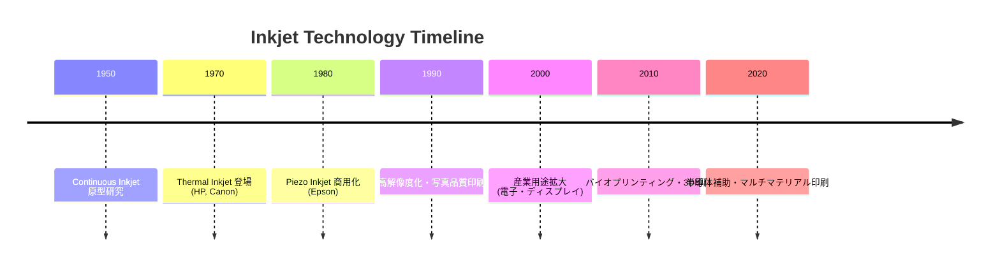

---

## 🏭 教育的・産業的意義 / Educational and Industrial Significance
1. **教育的意義**
   - 流体力学（微小液滴のジェット形成、不安定性、濡れ現象）の教材として有用  
   - 材料科学（インク組成、界面現象、機能性材料）の実例を提供  
   - 制御工学（駆動波形設計、フィードバック制御）の実践的教材  
   - 学際性（物理・化学・工学の統合分野）を学ぶ場として適切  

2. **産業的意義**
   - **印刷**: 商業印刷、パッケージ印刷におけるデジタル化推進  
   - **電子産業**: 配線形成、薄膜トランジスタ製造、ディスプレイ用パターニング  
   - **半導体産業**: レジスト塗布補助、マスクレスパターニング、材料局所堆積  
   - **バイオ産業**: 細胞配置、タンパク質印刷、ドラッグスクリーニング  
   - **エネルギー分野**: 太陽電池や燃料電池電極の製造  

---

## 🎯 本チュートリアルの目的と位置づけ / Purpose and Scope
- **体系化**: インクジェット技術を「原理 → 応用」まで学際的に体系化  
- **教育**: 学部・大学院教育および産業研修において、基礎から実用まで学べる教材を提供  
- **研究開発**: FEM解析・駆動波形設計・インクシステム最適化など、研究者が設計解析に活用可能な知識基盤を整理  
- **橋渡し**: 基礎研究（物理・材料・制御）と応用研究（半導体・バイオ・印刷）をつなぐ学際的教材として機能  

---

## ✨ 本章のまとめ / Summary
インクジェット技術は、単なるプリンタ技術にとどまらず、**流体・材料・制御を横断する学際領域**として発展してきた。  
その応用範囲は教育・研究・産業に広がり、今後の半導体・バイオ・エネルギー分野での重要性はさらに増すと考えられる。  
本チュートリアルは、この技術を包括的に整理し、**次世代研究・教育の基盤**となることを目的とする。

---

# 2. 駆動方式の原理 / Actuation Principles

## 🔎 駆動方式の分類 / Classification
インクジェットヘッドの駆動方式は、**液滴を生成するためにどのように圧力や力を加えるか**によって分類される。  
代表的な方式は以下の3つである。  
1. ピエゾ型 (Piezoelectric Actuation)  
2. サーマル型 (Thermal/Bubble Jet)  
3. 電場駆動型 (Electrohydrodynamic, EHD)  

---

## 🖼️ 駆動方式の模式図 / Conceptual Diagrams

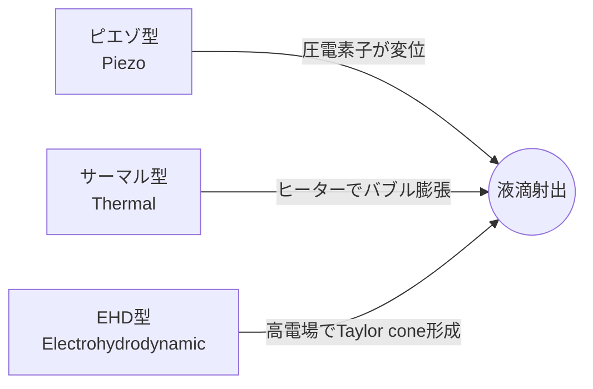

---

## 1️⃣ ピエゾ型 / Piezoelectric Actuation
### 🧩 原理
- 圧電素子（主に PZT: Pb(Zr,Ti)O₃）に電圧を印加すると、結晶が伸縮する **圧電効果** を利用。  
- この変位によってキャビティ内のインク圧力が変化し、液滴がノズルから射出される。  
- 駆動波形は通常 **数十 V ～ 100 V、数 µs オーダー**。  

### ⚙️ 特徴
- 非加熱方式であるため、**熱に弱いインク（バイオインク、機能性材料）**にも適用可能。  
- 高周波駆動（～100 kHz）が可能で、**産業用高速印刷**に広く使われる。  

### ✅ 利点
- 液滴サイズ制御の自由度が高い（駆動波形設計により最適化可能）。  
- 高い信頼性（数百億ショット以上の寿命）。  
- 多様なインクに対応（高粘度・ナノ粒子インクなど）。  

### ⚠️ 課題
- デバイス構造が複雑（MEMS加工が必要）。  
- 圧電材料に鉛 (Pb) が含まれる場合が多く、環境規制対応が課題。  

### 🎯 主な応用
- 産業用インクジェット印刷（パッケージ、商業印刷）  
- バイオプリンティング（細胞・タンパク質）  
- 機能性材料印刷（導電性インク、光学材料）  

---

## 2️⃣ サーマル型 / Thermal (Bubble Jet)
### 🧩 原理
- ノズル内部に微小ヒーターを設置し、電気パルスで局所的にインクを加熱（～300℃近傍、数 µs）。  
- インクが急激に気化して**バブル（気泡）**を形成し、その膨張圧力で液滴を射出。  
- 駆動電圧は低く、**10～20 V 程度**。  

### ⚙️ 特徴
- 構造がシンプルで製造コストが安い。  
- HP・Canon などの家庭用・オフィス用プリンタで主流。  

### ✅ 利点
- 低電圧駆動、低コストで大量生産に適する。  
- ノズル構造が簡易で、CMOS 集積回路と親和性が高い。  

### ⚠️ 課題
- 高温局所加熱によりインクの化学的性質が変化（色素分解、バイオ分子変性）。  
- インクの種類が制限される（熱安定性が必要）。  
- 信頼性はピエゾに比べて低く、**数十億ショットレベル**。  

### 🎯 主な応用
- 家庭用インクジェットプリンタ  
- 写真印刷用プリンタ  
- 一部の小型産業用途  

---

## 3️⃣ 電場駆動型 / Electrohydrodynamic (EHD)
### 🧩 原理
- ノズル先端に強い電場（数百 V ～ kV）を印加。  
- インク表面に電荷が誘起され、静電力によって**テイラーコーン (Taylor cone)** を形成。  
- 電場により液滴が射出される。  

### ⚙️ 特徴
- 非常に微細な液滴（サブミクロンレベル）を生成可能。  
- 駆動周波数は低速（～数 kHz）。  
- 高電圧が必要で、安定駆動が難しい。  

### ✅ 利点
- 微細パターニングに適し、半導体・ナノ材料応用に強み。  
- 表面張力・粘度の制約が比較的少ない。  

### ⚠️ 課題
- 高電圧駆動による安全性・安定性の課題。  
- ノズル周辺での帯電・スパークのリスク。  
- 産業実用化はまだ初期段階。  

### 🎯 主な応用
- 微細加工・ナノパターニング  
- 高分解能電子デバイス製造  
- 研究用途（実験室レベル）  

---

## 📊 駆動方式の比較 / Comparison Table
| 方式 | 駆動電圧 | 周波数帯域 | 信頼性 | 主な応用 |
|------|----------|------------|--------|----------|
| ピエゾ | 数十 V ～ 100 V | ～100 kHz（高速） | 高い（数百億ショット） | 産業印刷, バイオ, 機能性材料 |
| サーマル | 10 ～ 20 V | ～30 kHz（中速） | 中程度（数十億ショット） | 家庭用プリンタ, 写真印刷 |
| EHD | 数百 V ～ kV | ～数 kHz（低速） | 研究段階 | 微細加工, ナノ材料 |

---

## ✨ 本章のまとめ / Summary
- **ピエゾ型**は高信頼性・多様なインク対応で産業用途の主流。  
- **サーマル型**は低コスト・大量生産に適し、家庭用プリンタに広く普及。  
- **EHD型**は次世代微細加工に有望だが、安定性と安全性の課題が残る。  

インクジェット駆動方式の理解は、**液滴生成物理（第3章）や応用分野（第8章）**への架け橋となる。

---

# 3. 液滴生成の物理 / Droplet Formation Physics

## 💧 液滴形成メカニズム / Mechanisms of Droplet Formation

### 1. ジェット形成と不安定性
- インクジェットでは、ノズルからインクが微小な液柱（jet）として押し出される。  
- この液柱は表面張力により不安定化し、やがて分裂して液滴となる。  
- 主な現象は **レイリー‐プラトー不安定性 (Rayleigh–Plateau instability)**：  
  - 液柱の半径方向の揺らぎが成長し、液滴に分断される。  
  - 最も成長が速い波長はおおよそ「液柱直径の 4.5 倍」に相当。  
- この不安定性を利用して、安定かつ均一な液滴形成が可能となる。

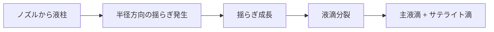

### 2. 液滴分裂とサテライト滴
- 主液滴 (primary drop) 生成の際に、後方に小さな「サテライト滴 (satellite drops)」が形成されることがある。  
- サテライト滴は印字品質を劣化させる要因であり、**駆動波形設計や流体物性の調整**で抑制する必要がある。  
- 特に粘度が低く、表面張力が大きい場合に発生しやすい。  

---

## 📐 無次元数 / Dimensionless Numbers
液滴生成の安定性・スケーリングを議論するために、以下の無次元数が用いられる。

### 1. レイノルズ数 (Re)

$$
Re = \frac{\rho U D}{\mu}
$$

- **ρ**: 液体密度  
- **U**: 液滴速度  
- **D**: ノズル径  
- **μ**: 粘度  
→ 慣性力と粘性力の比を表す。  
- インクジェットでは典型的に $Re \approx 10^2$ のオーダー。  

---

### 2. ウェーバー数 (We)

$$
We = \frac{\rho U^2 D}{\sigma}
$$

- **σ**: 表面張力  
→ 慣性力と表面張力の比。  
- $We < 1$: 液滴は形成されにくく、ノズル付近で戻る。  
- $We > 1$: 液滴が分離して飛翔する。  

---

### 3. オーネゾルゲ数 (Oh)

$$
Oh = \frac{\mu}{\sqrt{\rho \sigma D}}
$$

→ 粘性、慣性、表面張力のバランスを統合した指標。  
- **小さい ($Oh < 0.1$)**: サテライト滴が発生しやすい。  
- **大きい ($Oh > 1$)**: 粘性が強すぎて液滴が形成されにくい。  
- インクジェットでは $0.1 < Oh < 1$ が安定な液滴形成の条件域とされる。  

---

## 🔬 応用例 / Applications

### 1. 液滴径制御
- 液滴径は **ノズル径・駆動波形・流体物性**の複合的な関数。  
- 経験的に、液滴径はノズル径の $1 \sim 2$ 倍程度となる。  
- **パルス波形（バイポーラ波形、マルチパルス）**を調整することで、  
  - サテライト滴の抑制  
  - 液滴速度の制御  
  - 液滴径の均一化  
  が可能。  

### 2. 基板表面処理の影響
- 液滴が基板に衝突した後の挙動は、基板の **濡れ性 (wettability)** に強く依存する。  
- 接触角 (contact angle, $\theta$) により分類：  
  - 親水性基板（$\theta < 90^\circ$） → 液滴が広がる。  
  - 疎水性基板（$\theta > 90^\circ$） → 液滴が丸く留まる。  
- 表面処理（プラズマ処理、SAM, パターン化）により、  
  - 液滴の広がり径を制御  
  - マイクロパターン印刷や細胞配置を実現  

---

## 📊 代表値例 / Typical Ranges
| パラメータ | 代表値 |
|------------|--------|
| ノズル径 | 10–50 µm |
| 液滴速度 | 1–10 m/s |
| 液滴径 | 10–80 µm |
| Re | 10–500 |
| We | 1–20 |
| Oh | 0.1–1 |

---

## ✨ 本章のまとめ / Summary
- 液滴形成は **レイリー‐プラトー不安定性**に基づき、ジェットが液滴へと分裂する。  
- 液滴の安定性は **$Re$, $We$, $Oh$** によって支配される。  
- 安定した液滴生成には、**$0.1 < Oh < 1$** の範囲が重要。  
- 応用面では、**駆動波形設計**と**基板表面処理**により液滴径と配置を高度に制御できる。  

インクジェットの液滴生成物理は、**第4章「インクの物性」**および **第7章「設計・解析アプローチ」**に直結する基盤知識となる。

---

# 4. インク / Ink

## 🧪 インクの分類 / Classification of Inks

### 1. 染料系インク (Dye-based Ink)
- **構造**: 水や有機溶媒に溶解する低分子染料を主成分とする。  
- **特徴**:
  - 粒子が存在しないため **ノズル詰まりに強い**。  
  - 高い発色性・鮮明な色再現。  
  - 耐光性・耐水性は弱い。  
- **主な用途**: 写真印刷、家庭用プリンタ。

### 2. 顔料系インク (Pigment-based Ink)
- **構造**: 微粒子顔料（数十 nm）を分散剤とともに液中に懸濁させる。  
- **特徴**:
  - 耐水性・耐光性が高い。  
  - 高濃度で発色性も良い。  
  - 粒子凝集や沈降によるノズル詰まりリスクがある。  
- **主な用途**: 産業印刷、商業用ポスター、長期保存用印刷。

### 3. バイオインク (Bioink)
- **構造**: 細胞・タンパク質・核酸などを含む水系インク。  
- **特徴**:
  - 生体分子の活性保持が重要。  
  - 温度・せん断応力に敏感。  
  - 高粘度ゲル材料（アルギン酸、ゼラチン、ヒアルロン酸など）を基盤とする場合も多い。  
- **主な用途**: 細胞パターニング、臓器チップ、ドラッグスクリーニング。

### 4. 導電性インク (Conductive Ink)
- **構造**: 銀ナノ粒子、カーボンナノチューブ、グラフェン、導電性高分子を含む。  
- **特徴**:
  - 印刷後に **焼結処理 (sintering)** が必要な場合が多い。  
  - 高粘度傾向だが、ノズル詰まり防止の工夫が必要。  
- **主な用途**: プリント基板形成、RFIDアンテナ、フレキシブルエレクトロニクス。

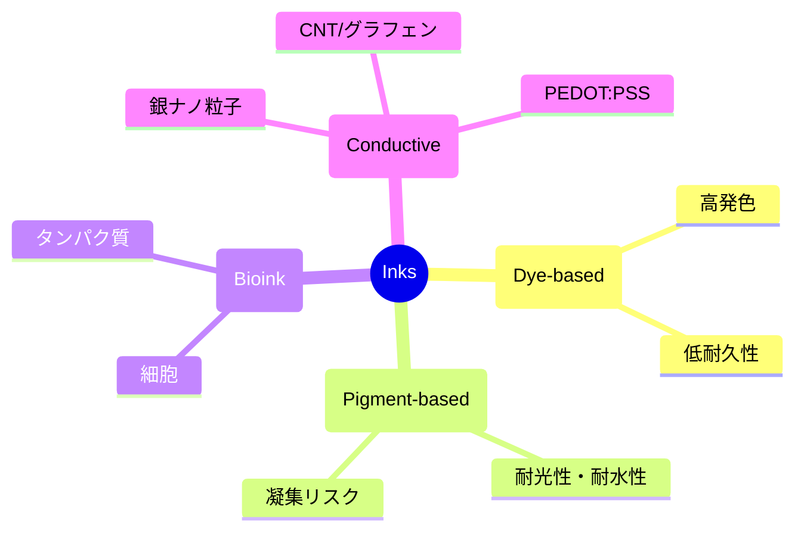

---

## ⚙️ インクの物性パラメータ / Physical Properties

1. **粘度 (Viscosity, μ)**  
   - インクジェット適用範囲は通常 **2–20 mPa·s**。  
   - 粘度が高いと吐出が困難、低いとサテライト滴が発生しやすい。  

2. **表面張力 (Surface tension, σ)**  
   - 適正範囲は **25–50 mN/m**。  
   - 低すぎると濡れすぎてにじみ、高すぎると液滴形成が困難。  

3. **密度 (Density, ρ)**  
   - 一般に **~1000 kg/m³**（水系インクの場合）。  
   - 慣性力・液滴速度の計算に関与。  

4. **揮発性 (Volatility)**  
   - 水や有機溶媒の蒸発速度は、**液滴飛翔中の乾燥**や**基板上での濡れ広がり**に影響。  
   - 高揮発性 → 乾燥早いがノズル詰まりやすい。  
   - 低揮発性 → ノズル安定性は高いが乾燥に時間がかかる。  

---

## 🧴 添加剤 / Additives
- **界面活性剤**: 表面張力を調整し、基板濡れ性を改善。  
- **分散剤**: 顔料やナノ粒子インクで粒子凝集を防止。  
- **防腐剤**: 水系インクでの微生物増殖を防止。  
- **バッファー剤**: バイオインクで pH 安定化。  
- **高分子安定剤**: 導電性インクでの沈降防止や粘度制御に利用。  

---

## 🧬 バイオ応用における特殊要件 / Bio-specific Considerations

1. **細胞生存率 (Cell Viability)**  
   - ノズル通過時のせん断応力や圧力変動が細胞膜損傷を引き起こす。  
   - ピエゾ駆動方式の適用では、生存率 **80–95%** を目標とする。  

2. **タンパク質活性保持 (Protein Activity Retention)**  
   - サーマル方式は高温局所加熱でタンパク質が変性しやすい。  
   - ピエゾ方式は非加熱のため、タンパク質・抗体印刷に適する。  
   - 活性保持のためには **添加剤 (グリセロール、トレハロース)** による安定化が有効。  

---

## 📊 代表値例 / Typical Ranges
| インク種別 | 粘度 (mPa·s) | 表面張力 (mN/m) | 特記事項 |
|------------|---------------|------------------|-----------|
| 染料系 | 2–5 | 30–40 | 高発色、低耐久性 |
| 顔料系 | 5–15 | 25–35 | 耐光性・耐水性高い |
| バイオインク | 2–20 | 30–50 | 細胞生存率が重要 |
| 導電性インク | 10–20 | 25–40 | 焼結処理が必要 |

---

## ✨ 本章のまとめ / Summary
- インクは **染料系・顔料系・バイオインク・導電性インク**に分類され、それぞれ特性と用途が異なる。  
- 安定な液滴生成には、**粘度 2–20 mPa·s、表面張力 25–50 mN/m** の範囲が重要。  
- 添加剤は印字品質やノズル安定性を支える重要な要素。  
- バイオ応用では、**細胞生存率・タンパク質活性**を維持する工夫が必須。  

インクの理解は、**第5章「インクシステム」**と**第8章「応用分野」**での設計・実用化に直結する。

---

# 5. インクシステム / Ink System

## ⚙️ 構成要素 / Components

### 1. インクカートリッジ (Ink Cartridge)
- インクを保持する容器。  
- **役割**: インク供給、気泡流入防止、残量モニタリング。  
- **設計考慮点**:
  - 容積変動による圧力変化（リザーバ構造の安定性）。  
  - 半透明樹脂やICチップで残量検知を行う設計が一般的。  
  - 高粘度・導電性インクでは耐薬品性や導電対策も必要。  

### 2. フィルタ (Filter)
- ノズル詰まりを防ぐために、**微粒子や気泡を除去**する。  
- **仕様例**: 0.2–1 µm メッシュフィルタ。  
- **課題**:
  - フィルタ目詰まりによる流量低下。  
  - インク物性に適した親水性／疎水性フィルタ材の選択が重要。  

### 3. デガス処理 (Degassing)
- インク中の溶存ガスや気泡を除去し、キャビティ内の**気泡成長による吐出不良**を防ぐ。  
- **方法**:
  - 真空脱気  
  - 膜脱気（中空糸膜を用いる方式）  
- **教育的ポイント**: 気泡は圧縮性が高く、圧力伝達を阻害するため「流体システムの不安定要因」となる。  

### 4. 循環機構 (Recirculation System)
- 特に顔料インクや導電性ナノインクで必要。  
- **役割**:
  - 粒子沈降や凝集を防ぐ。  
  - ノズル近傍での濃度変化を抑える。  
- **設計**:
  - ノズル直前で循環ラインを持たせ、常にインクが流動する構造。  
  - 圧力バランスと連動して流量を制御する。  

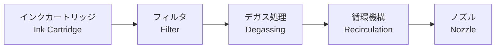

---

## 🛠️ 工学的制御 / Engineering Control

### 1. 圧力制御 (Pressure Control)
- インクを安定供給するために、リザーバ内圧を適切に調整。  
- 圧力が高すぎる → インク漏れや自発吐出。  
- 圧力が低すぎる → 吐出不良や気泡吸引。  
- 一般的に、**数百 Pa 単位の精密制御**が必要。  

### 2. 負圧バランス (Negative Pressure Balance)
- ノズル先端で**わずかな負圧**を維持し、インクが勝手に滴下しないようにする。  
- 実現手法:
  - メンブレン式リザーバ  
  - キャピラリーバランス構造  
- 教育的に重要なのは「**負圧は小さすぎても大きすぎても不安定要因**」となること。  

### 3. ノズル乾燥防止 (Nozzle Dry-out Prevention)
- ノズル先端が乾燥すると吐出不良の原因となる。  
- **対策**:
  - キャッピングユニット（湿潤環境でノズルを密閉）  
  - パージ（定期的なインク吐出でリフレッシュ）  
  - ヒューミディファイア（湿度制御）  

### 4. 吐出安定化 (Ejection Stabilization)
- 吐出のばらつきを抑えるために以下を制御：  
  - インク温度制御（粘度一定化）  
  - 循環流路による組成均一化  
  - 駆動波形と圧力の同期制御  
- 高精度産業用途（半導体・ディスプレイ印刷）では、**温度 ±0.1 ℃制御**や**圧力変動 ±10 Pa以下**が要求される。  

---

## 📊 インクシステム設計のトレードオフ
| 設計要素 | 望ましい特性 | 課題 |
|----------|--------------|------|
| フィルタ | 微粒子除去 | 目詰まりリスク |
| デガス処理 | 吐出安定化 | 装置コスト増 |
| 循環機構 | 粒子沈降防止 | 流体抵抗・圧力損失 |
| 負圧バランス | 自発滴下防止 | 吐出不良リスク |

---

## ✨ 本章のまとめ / Summary
- インクシステムは **インクカートリッジ → フィルタ → デガス処理 → 循環機構**から成り、  
  **安定供給・気泡抑制・粒子沈降防止**が鍵となる。  
- 工学的制御では、**圧力・負圧バランス・乾燥防止・吐出安定化**を統合的に実現する必要がある。  
- 特に産業用途では、**温度・圧力の精密制御**と**インク流路設計**が、吐出の再現性と信頼性を決定づける。  

インクシステムは、**第6章「材料・構造」**および **第7章「設計・解析アプローチ」**の前提となる実装技術である。

---

# 6. 材料・構造 / Device Structures & Materials

## 🧩 ノズル・キャビティ設計 / Nozzle & Cavity Design

### 基本設計指標 / Key Design Metrics
- **ノズル径 (D)**: 10–50 µm（微細印刷は ≤20 µm）  
- **テーパ角 (α)**: 3–8° 目安（噴射方向安定・サテライト抑制に寄与）  
- **アスペクト比 (L/D)**: 1–3 程度（過大だと粘性損失↑、過小だと指向性↓）  
- **キャビティ体積 (V_c)**: 10⁻¹²–10⁻¹⁰ m³（液滴量とアクチュエータ変位量に整合）  
- **表面性状**: ノズル縁の再入形状・微細リップはメニスカス安定化に有効

> 設計の狙い：**流体抵抗の最小化**と**噴射方向の再現性**、**メニスカスの再現性**（乾燥・気泡混入の抑制）

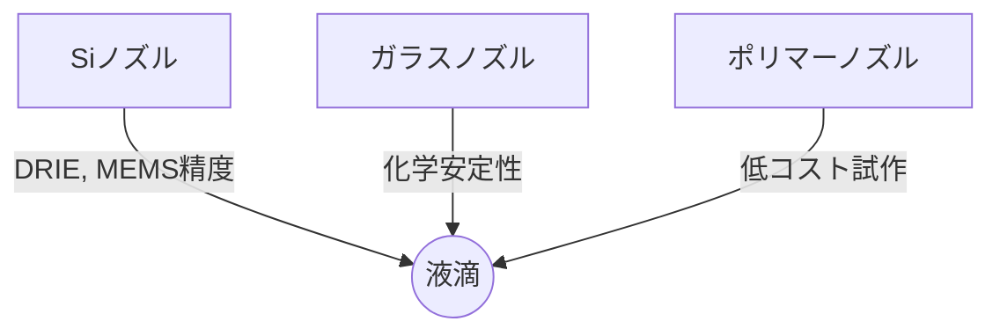

---

### Si（シリコン）ノズル / Silicon
- **加工**: DRIE（深堀り反応性イオンエッチング）、薄膜積層（SiN/SiO₂）、RDL 配線  
- **利点**: MEMS 精度、高アスペクト比、量産性、WLP（ウェハレベルパッケージ）適合  
- **課題**: 成膜応力による反り、DRIE 側壁粗さ、コスト  
- **表面処理**: 疎水化（フッ素系 SAM、Cytop）、親水化（O₂プラズマ）を用途で使い分け

### ガラスノズル / Glass
- **加工**: レーザードリル、湿式 HF 等方エッチ、パウダーブラスト  
- **利点**: 化学的安定性・低吸湿、**Si–ガラス陽極接合**でキャビティ封止が容易  
- **課題**: 形状自由度は Si に劣る、熱機械特性差による接合残留応力

### ポリマーノズル / Polymer (SU-8, PI, Parylene など)
- **加工**: LIGA/フォトリソ、ホットエンボス、射出成形、レーザー加工  
- **利点**: 低コスト、軽量、短サイクル試作、撥液コーティング適性  
- **課題**: 長期寸法安定性・耐溶剤性、温度依存性  
- **応用**: 研究用ヘッド、バイオ用途（低温プロセスで生体適合を確保）

#### まとめ表 / Quick Comparison
| 材料 | 加工自由度 | 化学/耐久 | コスト | 用途 |
|---|---|---|---|---|
| Si | 高 | 高 | 中～高 | 産業印刷、量産 MEMS |
| ガラス | 中 | 非常に高 | 中 | 化学・バイオ、封止兼用 |
| ポリマー | 非常に高 | 中 | 低 | 研究開発、試作、低温用途 |

## 材料比較表

| 材料 | 加工法 | 自由度 | 化学安定 | コスト | 用途 |
|------|--------|--------|----------|--------|------|
| Si | DRIE, 薄膜 | 高 | 高 | 中～高 | 産業印刷 |
| ガラス | レーザードリル | 中 | 非常に高 | 中 | 化学/バイオ |
| ポリマー | LIGA, 射出 | 非常に高 | 中 | 低 | 試作, バイオ |

---

## 🧲 圧電材料 / Piezoelectric Materials

### PZT（中心）/ Lead Zirconate Titanate
- **理由**: 高い圧電定数（例：$d_{31}, d_{33}$ が大）、比較的低電圧で所要変位が得やすい  
- **形態**: バルク板、厚膜（スクリーン印刷/スラリー）、薄膜（ソルゲル/スパッタ）  
- **代表特性の目安**  
  - ヤング率 $E$：50–70 GPa（組成依存）  
  - キュリー温度：200–350 °C（Mn, La 等添加で調整）  
  - 誘電率：$10^2$–$10^3$ オーダー  
- **駆動モード**  
  - **ベンド/ユニモルフ・バイモルフ**：大変位・低周波  
  - **プッシュ/スクイーズ/シア**：高周波・コンパクト  
- **信頼性**: 分極反転・疲労・脱分極に注意（電界強度・温度・湿度管理）

> **規制ノート**：Pb 含有だが、現行では多くの地域で**圧電用途に限定的免除**がある。RoHS 等の最新要件は運用時に確認。

### Pbフリー補足 / Lead-Free Options（補遺）
#### KNN 系（$(\mathrm{K,Na})\mathrm{NbO}_3$）
- **特徴**: 比較的高い $d_{33}$ が得られる配合があり、環境面で優位  
- **課題**: 焼結条件の難しさ、特性ばらつき、温度安定性  
- **適用**: 低環境負荷が最重視の用途、研究開発

#### ScAlN（スカンジウム添加 AlN）
- **特徴**: スパッタ薄膜で **CMOS プロセス親和性**、$e_{31,f}$ 向上で高感度  
- **利点**: 高周波・薄膜化、BEOL 近傍プロセスとの整合  
- **課題**: 高電界駆動時の疲労・リーク、残留応力管理、組成ウィンドウ管理  
- **適用**: **高周波・薄膜アクチュエータ**、将来の Pb-free 有力候補

#### 材料比較（概念）
| 材料 | 変位効率 | 作製容易性 | CMOS親和 | 環境適合 | 備考 |
|---|---|---|---|---|---|
| PZT | ◎ | ○ | △ | △ | 実績最大、免除適用が一般的 |
| KNN | ○ | △ | △ | ○ | 配合・焼結最適化が鍵 |
| ScAlN | △～○ | ○ | ◎ | ○ | 薄膜・高周波に強い |

## 🧲 圧電材料

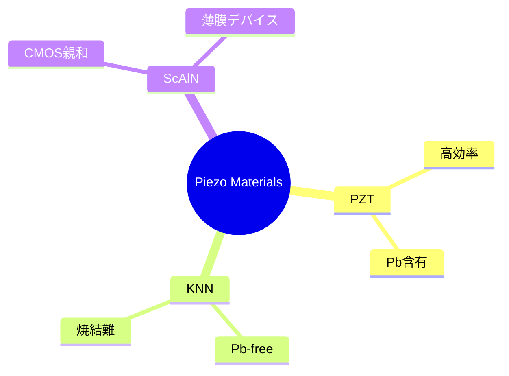

---

## 圧電材料比較

| 材料 | 変位効率 | CMOS親和 | 環境適合 | 備考 |
|------|----------|----------|----------|------|
| PZT | ◎ | △ | △ | 実績最大 |
| KNN | ○ | △ | ○ | Pb-free候補 |
| ScAlN | △～○ | ◎ | ○ | 薄膜応用 |

---

## 🧠 電気‐機械設計の要点 / Electro-Mechanical Co-Design
- **アクチュエータ容量 (C_act)**：数十～数百 pF/ノズル（設計依存） → 駆動回路の電流ピークと波形立上りに直結  
- **機械共振 (f₀)**：数十～数百 kHz → 駆動波形は $f₀$ 近傍の励起/抑制を設計（リンギング最小化）  
- **エネルギ**：1 滴あたり nJ–µJ レベル → エネルギ回生や多段パルスで低消費を図る  
- **流体系干渉**：キャビティ・流路の**音響インピーダンス整合**でサテライト抑制

> 目標は **吐出再現性・方向安定・サイズばらつき最小化**。構造固有モードと流体応答の同時最適化が必須。

---

## 🧷 保護膜・コーティング / Protective Films & Coatings
- **ノズル撥液**：フッ素系（Cytop, Teflon AF）で接触角を上げ**乾燥/汚染抑制**  
- **バリア/機械保護**：SiN, SiC, DLC, Al₂O₃（ECR/PECVD/ALD）  
- **導電性インク対策**：パリレンC/無電解 Ni–Au などで腐食抑制  
- **バイオ適合**：PEGylation/SAM、低タンパク吸着表面

---

## 🧱 封止・パッケージ / Sealing & Packaging
- **陽極接合（Si–ガラス）**：気密封止・位置精度  
- **フリップチップ/TSV/RDL**：高チャネル数の配線取り回し  
- **湿気バリア**：吸湿による PZT 特性劣化・短絡を防ぐ  
- **サービス性**：キャッピング、クリーニング、キャリブレーション用ポート

---

## 🧮 集積化 / Integration with CMOS Drivers

### なぜ集積か
- 多チャネル（～数千）を**高速・低ジッタ**で駆動  
- **レベルシフタ／HV ドライバ**で 30–100 V クラスの波形生成（PZT）  
- **DAC/タイミングエンジン**でパルス整形（押し・引き・減衰）と**個別補正（各ノズル補正）**

### 実装アーキテクチャ
1. **2D 実装**：ヘッド基板（MEMS）＋ 別体 HV-CMOS（FPC 接続）  
   - 汎用性高、熱分離が容易  
2. **2.5D/3D 実装**：同基板 or インターポーザで**近接実装**（RDL/µバンプ）  
   - 配線寄生低減、波形忠実度↑、ただし熱/組立プロセスの難度↑

### 回路設計の要点
- **波形整形**：プレカーサ／メイン／ダンピングの多段パルス  
- **電源**：昇圧 DC-DC、**エネルギ回生**（チャージリサイクル）  
- **同期**：サブ µs オーダーのスキュー管理、**クロストーク抑制**（帰還・グランド設計）  
- **ESD/EMC**：ノズル先端・配線の保護、静電ノイズと EHD 影響の両立  
- **温度制御**：オンチップサーミスタ/RTD、PID による粘度安定

---

## 🧪 信頼性・試験 / Reliability & Testing
- **機械疲労**：$10^9$–$10^{11}$ サイクル視野、駆動電界と応力のデリスキング  
- **キャビテーション/エロージョン**：急峻波形や高 We 条件で注意  
- **薄膜剥離/界面**：圧電/電極/バリアの密着、湿熱（85/85）  
- **粒子/気泡耐性**：フィルタリング・デガスの設計妥当性を寿命試験で検証

---

## 📚 設計ヒント / Practical Heuristics
- **ノズルテーパ**は 5° 前後から検討：指向性と粘性損失のトレードオフ最適点を探索  
- **再入リップ**でメニスカス固定 → 自発滴下と汚染を低減  
- **PZT** は素子厚・電極形状で感度最適化（$E=\!V/t$、電界分布の均一化）  
- **ScAlN 薄膜**は残留応力マップと歩留り管理が鍵  
- **配線寄生 (R, L, C)** を FEM/回路連成で前倒し評価（波形の角が丸まると液滴速度が不安定化）

---

## 集積化模式図

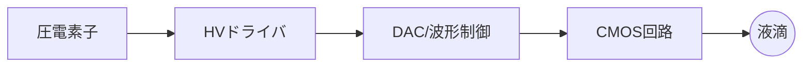
---

## ✨ 本章のまとめ / Summary
- **ノズル材料**は Si/ガラス/ポリマーでそれぞれ一長一短。用途・コスト・化学耐性で選定。  
- **圧電材料**は実績の PZT を中心に、Pb-free（KNN, ScAlN）を補完的に検討。  
- **CMOS 集積**は高チャネル・高再現性に不可欠で、HV 駆動・エネルギ回生・低寄生化が要件。  
- **信頼性**は材料・構造・回路・流体を跨いだシステム最適化で担保する。

> 本章は **第7章「設計・解析アプローチ」**（FEM/CFD 連成、波形最適化）に直結する設計前提である。

---

# 7. 設計・解析アプローチ / Design & Analysis

## 🧪 解析手法 / Analysis Methods

### 7.1 モデリングの階層 / Modeling Stack
1. **0D–1D 連成（等価回路/音響線路）**  
   - 目的: 設計初期の感度解析・波形探索。  
   - 表現: 流体系を **R（粘性抵抗）–L（流体慣性）–C（圧縮性）** に置換、PZT を **電気–機械変換器**として結合。  
   - ノズル/流路の流体インピーダンス（周波数領域）  
     $$
     Z_f(\omega) \approx R + j\omega L + \frac{1}{j\omega C}
     $$
   - 音響線路の基本インピーダンス  
     $$
     Z_0=\frac{\rho c}{A},\quad \Gamma=\frac{Z_L-Z_0}{Z_L+Z_0}
     $$
     （$\rho$: 密度, $c$: 音速, $A$: 断面, $Z_L$: 負荷）

2. **2D/3D FEM（構造–電気–音響）**  
   - 目的: 固有値解析（共振/反共振）、変位分布、キャビティ圧応答。  
   - 境界: PZT–電極に電位境界、流体側は音響境界/等価剛性で近似。  
   - 典型: PZT厚 10–40 µm、固有周波数 数十–数百 kHz。

3. **CFD/FSI（自由界面・濡れ）**  
   - 目的: メニスカス運動～ジェット化～分裂～着弾の予測。  
   - 手法: ALE/Level-Set/VOF（接触角・張力・接触角ヒステリシスを考慮）。  
   - 注意: 時間刻みは **表面張力キャップ時間**と **音速による最小時間刻み**に制約。

> 実務では **0D/1D→FEM→FSI** の段階最適化が有効（計算資源の節約と設計勾配の獲得）。

---

### 7.2 メッシュ・境界・数値安定 / Meshing & BC
- **流体**: ノズル径 $D$ に対しメッシュサイズ $\le D/20$、自由界面付近は $\le D/50$。  
- **時間刻み**: キャップ波速度 $c_\sigma=\sqrt{\sigma/(\rho D)}$ を用いて $\Delta t \lesssim 0.1\,D/c_\sigma$。  
- **接触角**: 進入/後退角を分離（例：$80^\circ/110^\circ$）。  
- **圧縮性**: キャビティは水でも有限圧縮性を考慮（$C\_fluid\sim V/\kappa$）。  
- **安定化**: 高We/低Oh 条件で界面拡散（Level-Set リイニシャライズ間隔の最適化）。

---

### 7.3 パラメタ同定 / Parameter Identification
- **静電容量 $C\_{act}$**（数十～数百 pF/ノズル）：LCR測定→波形電流ピーク整合。  
- **流体 RLC**：ステップ応答の立上り/リンギングから逆推定（Prony 分解）。  
- **界面特性**：ドロップウォッチの初速度・体積–波形の回帰で実効接触角/張力補正。

---

## 📈 波形設計 / Drive Waveform Design

### 7.4 バイポーラ/マルチパルス設計指針
- **基本形**（押し→保持→引き→減衰）  

# 7. 設計・解析アプローチ / Design & Analysis

## 🧪 解析手法 / Analysis Methods

### 7.1 モデリングの階層 / Modeling Stack

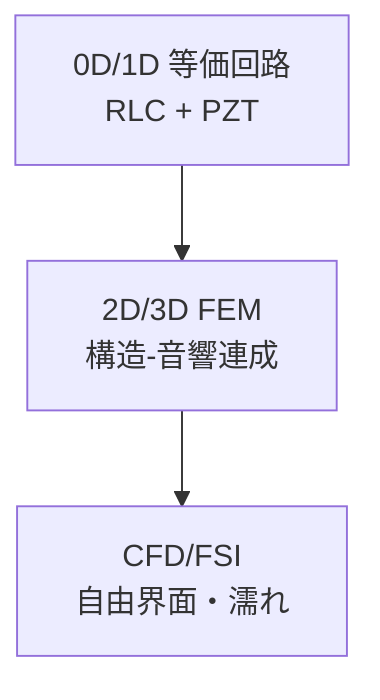

1. **0D–1D 等価回路**  
   - 流体を $RLC$ モデル化、PZT を電気-機械変換器で接続。  
   - 流体インピーダンス  
     $$
     Z_f(\omega) \approx R + j\omega L + \frac{1}{j\omega C}
     $$
   - 音響線路インピーダンス  
     $$
     Z_0=\frac{\rho c}{A},\quad \Gamma=\frac{Z_L-Z_0}{Z_L+Z_0}
     $$

2. **2D/3D FEM**  
   - 固有値解析（共振/反共振）、変位分布、キャビティ圧応答。  

3. **CFD/FSI**  
   - 自由界面追跡（Level-Set/VOF）。  
   - ジェット化～分裂～着弾まで解析。  

---

### 7.2 メッシュ・境界条件 / Meshing & BC

| 項目 | 設計指針 |
|------|----------|
| メッシュ | $D/20$ 以下（自由界面は $D/50$） |
| 時間刻み | $\Delta t \lesssim 0.1\,D/c_\sigma$ |
| 接触角 | 進入/後退角を分離（例：80°/110°） |
| 圧縮性 | キャビティ有限圧縮性を考慮 |
| 安定化 | Level-Set のリイニシャライズ間隔最適化 |

---

### 7.3 パラメタ同定 / Parameter Identification

- **静電容量 $C_{act}$**：LCR測定で同定。  
- **流体系RLC**：ステップ応答 → Prony分解。  
- **界面特性**：ドロップウォッチから波形–液滴速度の回帰。  

---

## 📈 波形設計 / Drive Waveform Design

### 7.4 バイポーラ/マルチパルス設計指針

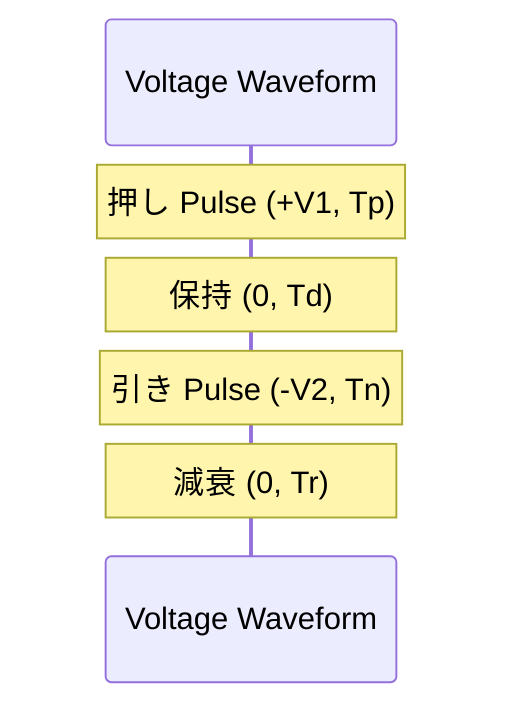

- **押し (Push)**: 液柱形成  
- **保持 (Dwell)**: 圧力安定化  
- **引き (Pull)**: メニスカス復元、サテライト抑制  
- **減衰 (Damp)**: リンギング抑制  

---

### 7.5 設計と解析の関係 / Workflow

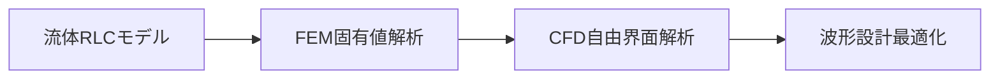

---

## ✨ 本章のまとめ / Summary
- 設計は **0D/1D → FEM → CFD/FSI** の多階層最適化が有効。  
- 波形設計では **バイポーラ/マルチパルス**により液滴径・速度・安定性を制御。  
- メッシュ分解能、時間刻み、界面条件の設定が解析精度を支配する。  

---

# 8. 応用分野 / Applications

## 🖨️ 印刷分野 / Printing Applications

### 1. インク印刷 (Conventional Ink Printing)
- **商業印刷**: 書籍・雑誌・広告など、大量印刷におけるデジタル化の推進。  
- **利点**:
  - 版を必要としないオンデマンド印刷（小ロット・可変データ印刷が容易）。  
  - 高解像度 (1200 dpi 以上) と写真品質の表現が可能。  
- **課題**:
  - 染料系インクでは耐光性・耐水性が低い。  
  - 印刷速度・スループットの向上が産業応用で重要。

### 2. 導電性材料印刷 (Printed Electronics)
- **対象材料**: 銀ナノ粒子インク、カーボンナノチューブ (CNT)、グラフェン、導電性高分子 (PEDOT:PSS)。  
- **用途例**:
  - フレキシブル回路基板  
  - RFID アンテナ  
  - タッチパネル用透明電極  
  - 太陽電池や有機EL素子の電極形成  
- **利点**:
  - 低コスト・マスクレス製造  
  - 曲面やフレキシブル基板への直接印刷が可能  
- **課題**:
  - 印刷後に焼結プロセスが必要（熱影響の制御）。  
  - 電気抵抗の均一化と信頼性向上。  

---

## 🧑‍🔬 半導体分野 / Semiconductor Applications

### 1. 絶縁膜形成 (Insulating Layer Deposition)
- レジスト・ポリイミド・有機絶縁膜を直接塗布。  
- **用途**: 半導体パッケージでの絶縁層、ディスプレイの絶縁パターン。  
- **利点**: マスクレス、局所塗布、材料削減。  
- **課題**: 膜厚均一性・ピンホール欠陥・表面粗さ管理。

### 2. 配線形成 (Metallization)
- 銀・銅ナノインクによる微細配線の直接描画。  
- **用途**: 再配線層 (RDL)、IC パッケージ、センサー。  
- **利点**:
  - フォトリソ工程の簡略化。  
  - 厚膜化や複数材料の積層印刷が可能。  
- **課題**:
  - 微細寸法制御（< 10 µm は難しい）。  
  - 導電性確保のための焼結条件最適化。

### 3. パターニング補助 (Patterning Assist)
- **例**: レジスト塗布の局所補正、エッチングマスク形成、フォトレジストのリペア。  
- **利点**: 微細欠陥修正や追加加工に柔軟に対応できる。  
- **課題**: 高精度位置合わせ、液滴径制御の安定性。  

---

## 🧬 バイオ分野 / Bio Applications

### 1. 細胞プリンティング (Cell Printing)
- **概要**: 細胞懸濁液をバイオインクとして吐出し、基板上に細胞を配置。  
- **用途**:
  - 組織工学 (Tissue Engineering)  
  - オルガノイド作製  
  - ドラッグスクリーニング用細胞アレイ  
- **利点**:
  - 微細かつ高精度な細胞配置。  
  - 生存率 80–95% を維持可能（ピエゾ型で特に有効）。  
- **課題**:
  - ノズル通過時のせん断応力・圧力変動による細胞損傷。  
  - 長時間運転時の細胞沈降・凝集防止。  

### 2. タンパク質マイクロアレイ (Protein Microarray)
- **概要**: 抗体・抗原・酵素などを基板上に微小スポットとして配置。  
- **用途**:
  - 疾患診断用バイオチップ  
  - バイオマーカー検出  
  - 高スループット薬剤スクリーニング  
- **利点**:
  - サンプル消費量の大幅削減（nL～pL）。  
  - 高密度配置による並列解析。  
- **課題**:
  - 活性保持（タンパク質変性の防止）。  
  - 表面固定化の最適化（化学修飾・SAM・ポリマー層）。  

--

## 🌐 応用マップ / Application Map

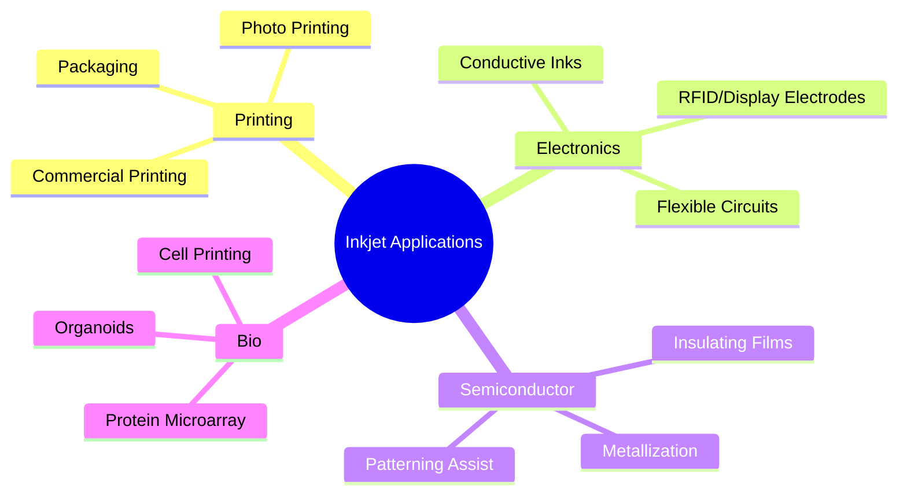

---

## 📊 応用分野まとめ / Summary Table

| 分野 | 主な用途 | 利点 | 課題 |
|------|----------|------|------|
| 印刷 | 商業印刷、写真、パッケージ | 高解像度、オンデマンド、小ロット対応 | 耐久性・スループット |
| 導電性材料 | 回路、電極、センサー | マスクレス、フレキシブル基板対応 | 焼結条件、導電性安定化 |
| 半導体 | 絶縁膜・配線・補助パターニング | 材料削減、プロセス短縮 | 微細寸法・膜厚均一性 |
| バイオ | 細胞、タンパク質配置 | 高精度配置、少量サンプル | 生存率・活性保持・沈降防止 |

---

## ✨ 本章のまとめ / Summary
- **印刷分野**では、インクジェットは従来印刷のデジタル化を推進し、導電性インクによる電子デバイス製造に展開。  
- **半導体分野**では、絶縁膜や配線形成に応用され、フォトリソ補助技術として微細加工にも利用可能。  
- **バイオ分野**では、細胞・タンパク質を扱う次世代バイオプリンティングの中核技術となっている。  

インクジェット技術の応用範囲は、**情報印刷 → エレクトロニクス → ライフサイエンス**へと拡張し続けており、学際的な研究・教育の格好の題材となる。

---

# 9. 教育的整理 / Educational Insights

## 🎓 教育的意義 / Educational Significance
インクジェット技術は、以下のように多分野を横断する「学際的教材」としての価値を持つ。  

- **流体力学**  
  - ジェット形成、レイリー–プラトー不安定性、Re・We・Oh 数によるスケーリング。  
- **材料科学**  
  - 染料系・顔料系・導電性インク・バイオインク、PZTやPbフリー圧電体の物性。  
- **制御工学**  
  - 駆動波形設計、フィードバック圧力制御、温度安定化。  
- **半導体・デバイス工学**  
  - MEMS ノズル加工、CMOS ドライバ集積、3Dパッケージング。  

このように **理論と実用が直結**する事例は工学教育で希少であり、基礎から応用まで一貫して学べる実践的題材として優れている。  

---

## 📝 学習課題例 / Example Learning Tasks

### 1. インク物性設計演習
- **課題内容**: 粘度、表面張力、密度を与えられた条件で設定し、無次元数 Re, We, Oh を算出。  
- **教育目標**: 液滴安定性条件（0.1 < Oh < 1, We > 1）の理解。  
- **応用展開**: 与えられた材料特性を基に「印刷可能か否か」を評価する設計演習。

### 2. インクシステム解析
- **課題内容**: 簡易流体系モデル（RLC 等価回路）を用い、リザーバ圧力変動がノズル吐出に与える影響を解析。  
- **教育目標**: 圧力制御・負圧バランスの役割を理解。  
- **応用展開**: フィルタ・デガス・循環機構の有無による比較。

### 3. 液滴生成シミュレーション
- **課題内容**: 数値流体力学（CFD, VOF/Level-Set 法）や簡易1Dモデルで液滴形成を再現。  
- **教育目標**: 波形設計（バイポーラ駆動）の違いが液滴径やサテライト発生に及ぼす影響を理解。  
- **応用展開**: 実測ドロップウォッチ結果と比較し、モデル妥当性を評価。

### 4. ケーススタディ課題（高度）
- **印刷応用**: 銀ナノインクを用いた配線形成での焼結条件設計。  
- **半導体応用**: フォトレジスト補修の精度要求を逆算。  
- **バイオ応用**: 細胞生存率と波形パラメータの関係を分析。

---

## 🔭 研究展望 / Future Research Directions

### 1. Pbフリー材料 / Lead-Free Piezoelectrics
- **背景**: RoHS 規制強化により、PZT 代替が求められている。  
- **候補材料**:
  - KNN 系（K,Na)NbO₃：高変位性能だが焼結条件が難しい。  
  - ScAlN：CMOS プロセス親和性が高く、将来の高周波応用に有望。  
- **研究課題**: 長期安定性、温度依存性、量産適用性。

### 2. 低電圧駆動 / Low-Voltage Actuation
- **背景**: モバイル・ウェアラブル応用では消費電力削減が必須。  
- **手法**:
  - 薄膜圧電体（数 µm 以下）の適用。  
  - CMOS ドライバとの3D積層実装による低電圧化。  
  - EHD 低電圧化のためのノズル微細加工。  
- **研究課題**: 出力変位確保との両立。

### 3. バイオ融合 / Bio-Integration
- **背景**: 再生医療・創薬分野での応用拡大。  
- **方向性**:
  - 高生存率の細胞プリンティング技術。  
  - タンパク質活性を維持したマイクロアレイ形成。  
  - オルガノイド・Lab-on-a-Chip との融合。  
- **研究課題**: ノズルの生体適合材料化、インク粘弾性設計、リアルタイムフィードバック制御。

---

## ✨ 本章のまとめ / Summary
- インクジェットは **学際的教材**として流体・材料・制御・半導体を統合的に学べる。  
- **学習課題例**を通じて、学生・研究者は基礎物性からシステム設計・応用まで一貫して学習可能。  
- **研究展望**としては Pbフリー材料、低電圧駆動、バイオ融合が次世代の重要テーマである。  

教育現場では「理論 → 設計演習 → 実験 → 応用展望」の流れを通じて、  
インクジェットを **次世代の学際教育プラットフォーム**として活用できる。

---

# 9. 教育的整理 / Educational Insights

## 🎓 教育的意義 / Educational Significance
インクジェット技術は、以下のように多分野を横断する「学際的教材」としての価値を持つ。  

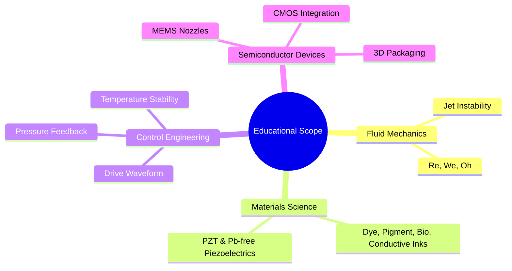

---

## 📝 学習課題例 / Example Learning Tasks

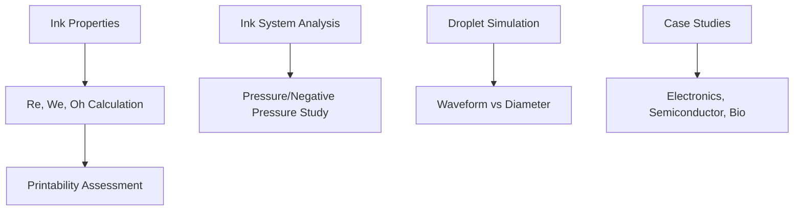

### 主な演習
1. インク物性設計演習 → Re, We, Oh 算出  
2. インクシステム解析 → RLC モデルで圧力影響を評価  
3. 液滴生成シミュレーション → 波形設計効果を可視化  
4. ケーススタディ → 銀ナノインク、フォトレジスト修復、細胞生存率分析  

---

## 🔭 研究展望 / Future Research Directions

### 研究課題マップ
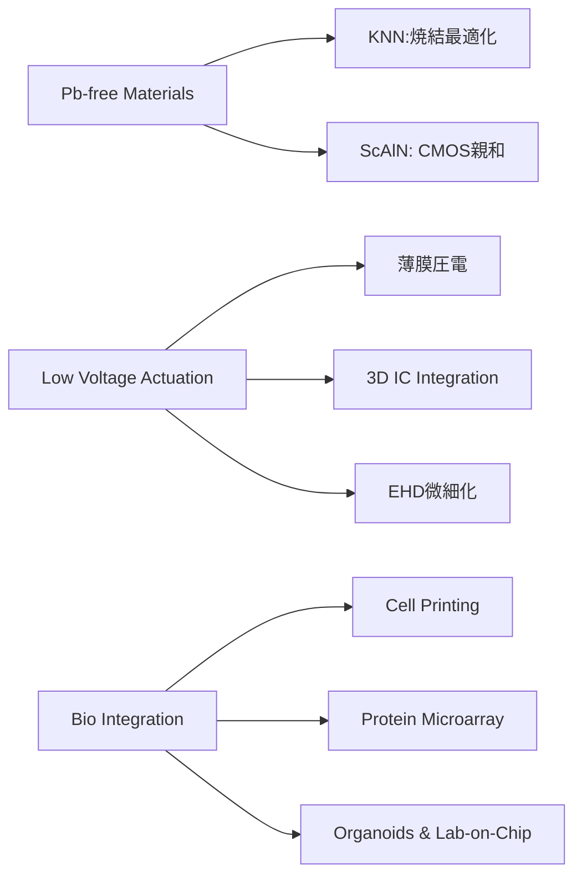

---

## ✨ 本章のまとめ / Summary
- インクジェットは **学際的教材**として流体・材料・制御・半導体を統合的に学べる。  
- **学習課題例**により、基礎から応用まで一貫した教育が可能。  
- **研究展望**では Pbフリー材料、低電圧駆動、バイオ融合が次世代の重要テーマ。  

👉 教育現場では「理論 → 設計演習 → 実験 → 応用展望」の流れで、  
インクジェットを **次世代の学際教育プラットフォーム**として活用できる。

---

