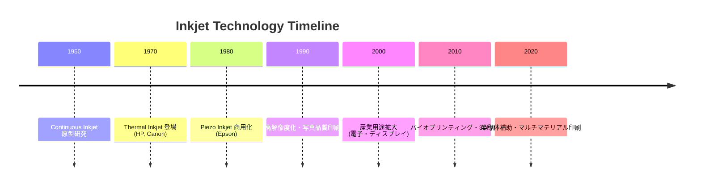
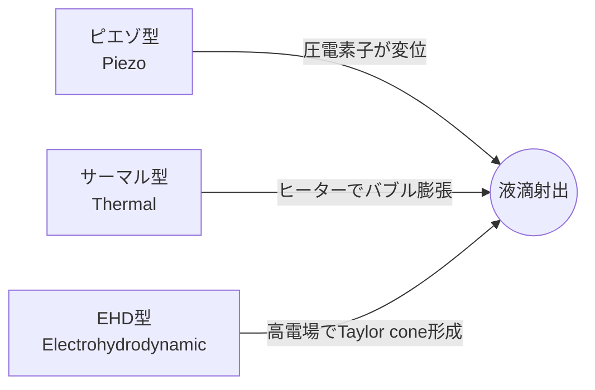
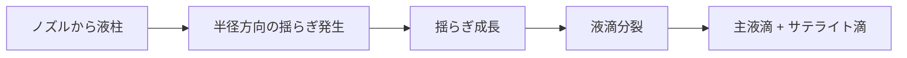
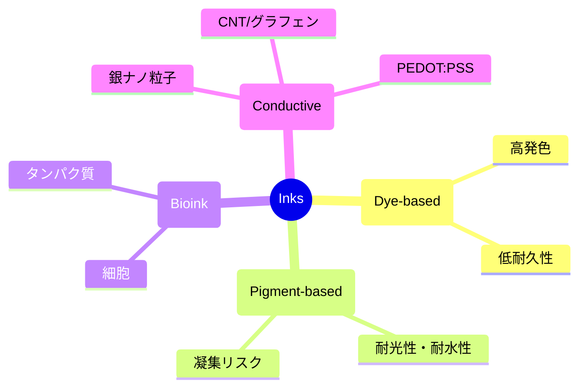

# 1. 序論 / Introduction

## 📜 背景 / Background
インクジェット技術は、1970年代にプリンタ用途として商用化され、その後の数十年で急速に発展した。  
初期は家庭用・オフィス用プリンタを中心に発展し、**高解像度・低コスト印刷**を実現したことから広く普及した。  
1990年代以降、産業用途に拡張され、**電子デバイス製造・ディスプレイ・半導体補助プロセス**などの分野に応用が広がっている。  
さらに21世紀に入ると、**バイオプリンティング**（細胞・タンパク質の配置、ドラッグスクリーニング）や**アディティブマニュファクチャリング**（3Dプリント）にも利用され、学際的技術として位置づけられるようになった。

---

## 🕰️ インクジェットの歴史と進化 / History and Evolution

---

## 🏭 教育的・産業的意義 / Educational and Industrial Significance
1. **教育的意義**
   - 流体力学（微小液滴のジェット形成、不安定性、濡れ現象）の教材として有用  
   - 材料科学（インク組成、界面現象、機能性材料）の実例を提供  
   - 制御工学（駆動波形設計、フィードバック制御）の実践的教材  
   - 学際性（物理・化学・工学の統合分野）を学ぶ場として適切  

2. **産業的意義**
   - **印刷**: 商業印刷、パッケージ印刷におけるデジタル化推進  
   - **電子産業**: 配線形成、薄膜トランジスタ製造、ディスプレイ用パターニング  
   - **半導体産業**: レジスト塗布補助、マスクレスパターニング、材料局所堆積  
   - **バイオ産業**: 細胞配置、タンパク質印刷、ドラッグスクリーニング  
   - **エネルギー分野**: 太陽電池や燃料電池電極の製造  

---

## 🎯 本チュートリアルの目的と位置づけ / Purpose and Scope
- **体系化**: インクジェット技術を「原理 → 応用」まで学際的に体系化  
- **教育**: 学部・大学院教育および産業研修において、基礎から実用まで学べる教材を提供  
- **研究開発**: FEM解析・駆動波形設計・インクシステム最適化など、研究者が設計解析に活用可能な知識基盤を整理  
- **橋渡し**: 基礎研究（物理・材料・制御）と応用研究（半導体・バイオ・印刷）をつなぐ学際的教材として機能  

---

## ✨ 本章のまとめ / Summary
インクジェット技術は、単なるプリンタ技術にとどまらず、**流体・材料・制御を横断する学際領域**として発展してきた。  
その応用範囲は教育・研究・産業に広がり、今後の半導体・バイオ・エネルギー分野での重要性はさらに増すと考えられる。  
本チュートリアルは、この技術を包括的に整理し、**次世代研究・教育の基盤**となることを目的とする。

---

# 2. 駆動方式の原理 / Actuation Principles

## 🔎 駆動方式の分類 / Classification
インクジェットヘッドの駆動方式は、**液滴を生成するためにどのように圧力や力を加えるか**によって分類される。  
代表的な方式は以下の3つである。  
1. ピエゾ型 (Piezoelectric Actuation)  
2. サーマル型 (Thermal/Bubble Jet)  
3. 電場駆動型 (Electrohydrodynamic, EHD)  

---

## 🖼️ 駆動方式の模式図 / Conceptual Diagrams

---

## 1️⃣ ピエゾ型 / Piezoelectric Actuation
### 🧩 原理
- 圧電素子（主に PZT: Pb(Zr,Ti)O₃）に電圧を印加すると、結晶が伸縮する **圧電効果** を利用。  
- この変位によってキャビティ内のインク圧力が変化し、液滴がノズルから射出される。  
- 駆動波形は通常 **数十 V ～ 100 V、数 µs オーダー**。  

### ⚙️ 特徴
- 非加熱方式であるため、**熱に弱いインク（バイオインク、機能性材料）**にも適用可能。  
- 高周波駆動（～100 kHz）が可能で、**産業用高速印刷**に広く使われる。  

### ✅ 利点
- 液滴サイズ制御の自由度が高い（駆動波形設計により最適化可能）。  
- 高い信頼性（数百億ショット以上の寿命）。  
- 多様なインクに対応（高粘度・ナノ粒子インクなど）。  

### ⚠️ 課題
- デバイス構造が複雑（MEMS加工が必要）。  
- 圧電材料に鉛 (Pb) が含まれる場合が多く、環境規制対応が課題。  

### 🎯 主な応用
- 産業用インクジェット印刷（パッケージ、商業印刷）  
- バイオプリンティング（細胞・タンパク質）  
- 機能性材料印刷（導電性インク、光学材料）  

---

## 2️⃣ サーマル型 / Thermal (Bubble Jet)
### 🧩 原理
- ノズル内部に微小ヒーターを設置し、電気パルスで局所的にインクを加熱（～300℃近傍、数 µs）。  
- インクが急激に気化して**バブル（気泡）**を形成し、その膨張圧力で液滴を射出。  
- 駆動電圧は低く、**10～20 V 程度**。  

### ⚙️ 特徴
- 構造がシンプルで製造コストが安い。  
- HP・Canon などの家庭用・オフィス用プリンタで主流。  

### ✅ 利点
- 低電圧駆動、低コストで大量生産に適する。  
- ノズル構造が簡易で、CMOS 集積回路と親和性が高い。  

### ⚠️ 課題
- 高温局所加熱によりインクの化学的性質が変化（色素分解、バイオ分子変性）。  
- インクの種類が制限される（熱安定性が必要）。  
- 信頼性はピエゾに比べて低く、**数十億ショットレベル**。  

### 🎯 主な応用
- 家庭用インクジェットプリンタ  
- 写真印刷用プリンタ  
- 一部の小型産業用途  

---

## 3️⃣ 電場駆動型 / Electrohydrodynamic (EHD)
### 🧩 原理
- ノズル先端に強い電場（数百 V ～ kV）を印加。  
- インク表面に電荷が誘起され、静電力によって**テイラーコーン (Taylor cone)** を形成。  
- 電場により液滴が射出される。  

### ⚙️ 特徴
- 非常に微細な液滴（サブミクロンレベル）を生成可能。  
- 駆動周波数は低速（～数 kHz）。  
- 高電圧が必要で、安定駆動が難しい。  

### ✅ 利点
- 微細パターニングに適し、半導体・ナノ材料応用に強み。  
- 表面張力・粘度の制約が比較的少ない。  

### ⚠️ 課題
- 高電圧駆動による安全性・安定性の課題。  
- ノズル周辺での帯電・スパークのリスク。  
- 産業実用化はまだ初期段階。  

### 🎯 主な応用
- 微細加工・ナノパターニング  
- 高分解能電子デバイス製造  
- 研究用途（実験室レベル）  

---

## 📊 駆動方式の比較 / Comparison Table
| 方式 | 駆動電圧 | 周波数帯域 | 信頼性 | 主な応用 |
|------|----------|------------|--------|----------|
| ピエゾ | 数十 V ～ 100 V | ～100 kHz（高速） | 高い（数百億ショット） | 産業印刷, バイオ, 機能性材料 |
| サーマル | 10 ～ 20 V | ～30 kHz（中速） | 中程度（数十億ショット） | 家庭用プリンタ, 写真印刷 |
| EHD | 数百 V ～ kV | ～数 kHz（低速） | 研究段階 | 微細加工, ナノ材料 |

---

## ✨ 本章のまとめ / Summary
- **ピエゾ型**は高信頼性・多様なインク対応で産業用途の主流。  
- **サーマル型**は低コスト・大量生産に適し、家庭用プリンタに広く普及。  
- **EHD型**は次世代微細加工に有望だが、安定性と安全性の課題が残る。  

インクジェット駆動方式の理解は、**液滴生成物理（第3章）や応用分野（第8章）**への架け橋となる。

---

# 3. 液滴生成の物理 / Droplet Formation Physics

## 💧 液滴形成メカニズム / Mechanisms of Droplet Formation

### 1. ジェット形成と不安定性
- インクジェットでは、ノズルからインクが微小な液柱（jet）として押し出される。  
- この液柱は表面張力により不安定化し、やがて分裂して液滴となる。  
- 主な現象は **レイリー‐プラトー不安定性 (Rayleigh–Plateau instability)**：  
  - 液柱の半径方向の揺らぎが成長し、液滴に分断される。  
  - 最も成長が速い波長はおおよそ「液柱直径の 4.5 倍」に相当。  
- この不安定性を利用して、安定かつ均一な液滴形成が可能となる。

### 2. 液滴分裂とサテライト滴
- 主液滴 (primary drop) 生成の際に、後方に小さな「サテライト滴 (satellite drops)」が形成されることがある。  
- サテライト滴は印字品質を劣化させる要因であり、**駆動波形設計や流体物性の調整**で抑制する必要がある。  
- 特に粘度が低く、表面張力が大きい場合に発生しやすい。  

---

## 📐 無次元数 / Dimensionless Numbers
液滴生成の安定性・スケーリングを議論するために、以下の無次元数が用いられる。

### 1. レイノルズ数 (Re)

$$
Re = \frac{\rho U D}{\mu}
$$

- **ρ**: 液体密度  
- **U**: 液滴速度  
- **D**: ノズル径  
- **μ**: 粘度  
→ 慣性力と粘性力の比を表す。  
- インクジェットでは典型的に $Re \approx 10^2$ のオーダー。  

---

### 2. ウェーバー数 (We)

$$
We = \frac{\rho U^2 D}{\sigma}
$$

- **σ**: 表面張力  
→ 慣性力と表面張力の比。  
- $We < 1$: 液滴は形成されにくく、ノズル付近で戻る。  
- $We > 1$: 液滴が分離して飛翔する。  

---

### 3. オーネゾルゲ数 (Oh)

$$
Oh = \frac{\mu}{\sqrt{\rho \sigma D}}
$$

→ 粘性、慣性、表面張力のバランスを統合した指標。  
- **小さい ($Oh < 0.1$)**: サテライト滴が発生しやすい。  
- **大きい ($Oh > 1$)**: 粘性が強すぎて液滴が形成されにくい。  
- インクジェットでは $0.1 < Oh < 1$ が安定な液滴形成の条件域とされる。  

---

## 🔬 応用例 / Applications

### 1. 液滴径制御
- 液滴径は **ノズル径・駆動波形・流体物性**の複合的な関数。  
- 経験的に、液滴径はノズル径の $1 \sim 2$ 倍程度となる。  
- **パルス波形（バイポーラ波形、マルチパルス）**を調整することで、  
  - サテライト滴の抑制  
  - 液滴速度の制御  
  - 液滴径の均一化  
  が可能。  

### 2. 基板表面処理の影響
- 液滴が基板に衝突した後の挙動は、基板の **濡れ性 (wettability)** に強く依存する。  
- 接触角 (contact angle, $\theta$) により分類：  
  - 親水性基板（$\theta < 90^\circ$） → 液滴が広がる。  
  - 疎水性基板（$\theta > 90^\circ$） → 液滴が丸く留まる。  
- 表面処理（プラズマ処理、SAM, パターン化）により、  
  - 液滴の広がり径を制御  
  - マイクロパターン印刷や細胞配置を実現  

---

## 📊 代表値例 / Typical Ranges
| パラメータ | 代表値 |
|------------|--------|
| ノズル径 | 10–50 µm |
| 液滴速度 | 1–10 m/s |
| 液滴径 | 10–80 µm |
| Re | 10–500 |
| We | 1–20 |
| Oh | 0.1–1 |

---

## ✨ 本章のまとめ / Summary
- 液滴形成は **レイリー‐プラトー不安定性**に基づき、ジェットが液滴へと分裂する。  
- 液滴の安定性は **$Re$, $We$, $Oh$** によって支配される。  
- 安定した液滴生成には、**$0.1 < Oh < 1$** の範囲が重要。  
- 応用面では、**駆動波形設計**と**基板表面処理**により液滴径と配置を高度に制御できる。  

インクジェットの液滴生成物理は、**第4章「インクの物性」**および **第7章「設計・解析アプローチ」**に直結する基盤知識となる。

---

# 4. インク / Ink

## 🧪 インクの分類 / Classification of Inks

### 1. 染料系インク (Dye-based Ink)
- **構造**: 水や有機溶媒に溶解する低分子染料を主成分とする。  
- **特徴**:
  - 粒子が存在しないため **ノズル詰まりに強い**。  
  - 高い発色性・鮮明な色再現。  
  - 耐光性・耐水性は弱い。  
- **主な用途**: 写真印刷、家庭用プリンタ。

### 2. 顔料系インク (Pigment-based Ink)
- **構造**: 微粒子顔料（数十 nm）を分散剤とともに液中に懸濁させる。  
- **特徴**:
  - 耐水性・耐光性が高い。  
  - 高濃度で発色性も良い。  
  - 粒子凝集や沈降によるノズル詰まりリスクがある。  
- **主な用途**: 産業印刷、商業用ポスター、長期保存用印刷。

### 3. バイオインク (Bioink)
- **構造**: 細胞・タンパク質・核酸などを含む水系インク。  
- **特徴**:
  - 生体分子の活性保持が重要。  
  - 温度・せん断応力に敏感。  
  - 高粘度ゲル材料（アルギン酸、ゼラチン、ヒアルロン酸など）を基盤とする場合も多い。  
- **主な用途**: 細胞パターニング、臓器チップ、ドラッグスクリーニング。

### 4. 導電性インク (Conductive Ink)
- **構造**: 銀ナノ粒子、カーボンナノチューブ、グラフェン、導電性高分子を含む。  
- **特徴**:
  - 印刷後に **焼結処理 (sintering)** が必要な場合が多い。  
  - 高粘度傾向だが、ノズル詰まり防止の工夫が必要。  
- **主な用途**: プリント基板形成、RFIDアンテナ、フレキシブルエレクトロニクス。

---

## ⚙️ インクの物性パラメータ / Physical Properties

1. **粘度 (Viscosity, μ)**  
   - インクジェット適用範囲は通常 **2–20 mPa·s**。  
   - 粘度が高いと吐出が困難、低いとサテライト滴が発生しやすい。  

2. **表面張力 (Surface tension, σ)**  
   - 適正範囲は **25–50 mN/m**。  
   - 低すぎると濡れすぎてにじみ、高すぎると液滴形成が困難。  

3. **密度 (Density, ρ)**  
   - 一般に **~1000 kg/m³**（水系インクの場合）。  
   - 慣性力・液滴速度の計算に関与。  

4. **揮発性 (Volatility)**  
   - 水や有機溶媒の蒸発速度は、**液滴飛翔中の乾燥**や**基板上での濡れ広がり**に影響。  
   - 高揮発性 → 乾燥早いがノズル詰まりやすい。  
   - 低揮発性 → ノズル安定性は高いが乾燥に時間がかかる。  

---

## 🧴 添加剤 / Additives
- **界面活性剤**: 表面張力を調整し、基板濡れ性を改善。  
- **分散剤**: 顔料やナノ粒子インクで粒子凝集を防止。  
- **防腐剤**: 水系インクでの微生物増殖を防止。  
- **バッファー剤**: バイオインクで pH 安定化。  
- **高分子安定剤**: 導電性インクでの沈降防止や粘度制御に利用。  

---

## 🧬 バイオ応用における特殊要件 / Bio-specific Considerations

1. **細胞生存率 (Cell Viability)**  
   - ノズル通過時のせん断応力や圧力変動が細胞膜損傷を引き起こす。  
   - ピエゾ駆動方式の適用では、生存率 **80–95%** を目標とする。  

2. **タンパク質活性保持 (Protein Activity Retention)**  
   - サーマル方式は高温局所加熱でタンパク質が変性しやすい。  
   - ピエゾ方式は非加熱のため、タンパク質・抗体印刷に適する。  
   - 活性保持のためには **添加剤 (グリセロール、トレハロース)** による安定化が有効。  

---

## 📊 代表値例 / Typical Ranges
| インク種別 | 粘度 (mPa·s) | 表面張力 (mN/m) | 特記事項 |
|------------|---------------|------------------|-----------|
| 染料系 | 2–5 | 30–40 | 高発色、低耐久性 |
| 顔料系 | 5–15 | 25–35 | 耐光性・耐水性高い |
| バイオインク | 2–20 | 30–50 | 細胞生存率が重要 |
| 導電性インク | 10–20 | 25–40 | 焼結処理が必要 |

---

## ✨ 本章のまとめ / Summary
- インクは **染料系・顔料系・バイオインク・導電性インク**に分類され、それぞれ特性と用途が異なる。  
- 安定な液滴生成には、**粘度 2–20 mPa·s、表面張力 25–50 mN/m** の範囲が重要。  
- 添加剤は印字品質やノズル安定性を支える重要な要素。  
- バイオ応用では、**細胞生存率・タンパク質活性**を維持する工夫が必須。  

インクの理解は、**第5章「インクシステム」**と**第8章「応用分野」**での設計・実用化に直結する。

---

