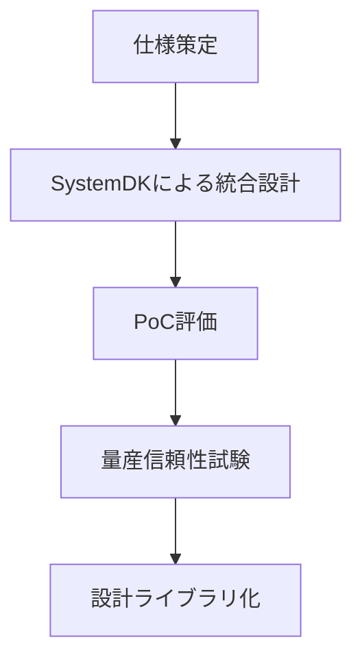
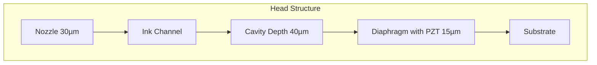

# SystemDKを用いた産業用ピエゾインクジェット設計支援フレームワークの提案

## 1. 序論 (Introduction)
産業用インクジェット技術は、テキスタイル印刷、プリント配線板（PCB）の形成、パッケージ製造など、多様な分野において不可欠な基盤技術となっている。特に近年は、電子デバイスや機能性材料の加工にまで応用が広がっており、その重要性は一層高まっている [6][7]。

インクジェット方式には大きくサーマル方式とピエゾ方式が存在する。サーマル方式は加熱によってインクを気化させ液滴を生成するため、低コストで小型化に有利でありコンシューマ用途に広く普及している。しかし高温に耐える必要があるため、インク材料の選択が大きく制約される。一方、ピエゾ方式は圧電素子の変形を利用して液滴を射出するため、加熱を伴わず、粘度や表面張力の幅広い材料に適応できる。そのため、産業用途ではピエゾ方式が主流となっている [6]。

しかし、産業用ピエゾインクジェットの設計は、電気（駆動回路）、機械（圧電素子・ダイアフラム）、流体（ノズル内流れ・液滴形成）、材料（インク特性）が強く連成する複雑な問題である。従来手法では分野ごとに解析が分断され、試作と実験に依存するため、開発コスト増大とサイクル長期化が避けられないという課題があった。

本研究では、SystemDK（System Design Kit）の概念を産業用ピエゾインクジェット設計に応用する。SystemDKは半導体分野のPDKに着想を得た設計支援フレームワークであり、複数の物理領域を統合的に扱うことができる。本研究の貢献は以下の3点にまとめられる。

1. SystemDKを産業用ピエゾインクジェット設計に応用し、多分野連成を統合するフレームワークを提示する。
2. 電気・機械・流体モデルを統合し、再利用可能な設計ライブラリを構築する。
3. 設計効率・再現性・高速PoC（Proof of Concept）を実現する新たな手法を提案する。

---

## 2. 関連研究 (Related Work)
ピエゾインクジェットの研究は長年にわたり、主に駆動波形設計、数値流体解析（CFD）、有限要素解析（FEM）、およびそれらの連成解析を中心に発展してきた。

Boccio [1] はCFDにより液滴形成過程を解析し、実験との比較で液滴径において約15%、速度において約30%の誤差を報告した。Leiら [3] もCFDモデルを最適化し、実験的検証を行ったが、やはり一定の誤差が残ることを示している。Kimら [2] は供給圧の影響を解析し、シミュレーションと実験結果の一致率が約87%であることを報告した。

一方、Shinら [4] は圧電素子の膜変形と流体解析を組み合わせた流体–構造連成モデルを構築し、OLED印刷に適用することで数値解析と実験結果の整合性を確認している。これらの研究は、個別の連成解析や特定条件下での精度向上を示しているが、設計効率や再利用性の観点は十分に議論されていない。

モデルベース設計（Model-Based Design, MBD）は工学設計に広く用いられているが、ピエゾインクジェットのように電気・機械・流体が強く結合した分野では、部分的な適用にとどまっている。設計支援フレームワークの既存アプローチも存在するが、分野横断的な統合と高速PoCを実現する仕組みは未だ不十分である。

本研究はこれら既存研究を踏まえ、SystemDKを用いて電気・機械・流体モデルを包括的に統合し、設計効率・再利用性・スピードを重視した新しい枠組みを提示する点に新規性がある。

---

## 3. 提案手法 (Proposed Framework)

### 設計フロー
以下に、本研究で提案する設計フローを示す。

---

## 4. 実装 (Implementation)

### ヘッド構造模式図

### 各仕様
- **アクチュエータ仕様**：PZT膜厚 15 µm、駆動電圧 ±25 V、共振周波数 120 kHz  
- **インクシステム仕様**：供給圧 5 kPa、リザーバ容量 2 ml、温調精度 ±0.5 ℃  
- **インク仕様**：銀ナノインク（粘度10 cP、表面張力30 mN/m、密度1.1 g/cm³）  
- **駆動回路仕様**：立上り 2 µs・保持 8 µs・減衰 2 µs、反転 −5 V・5 µs のバイポーラ駆動波形  
- **ヘッド構造仕様**：ノズル径 30 µm、配列ピッチ 50 µm、キャビティ深さ 40 µm  

---

## 5. 評価 (Evaluation)
比較対象は、(a) 従来手法（個別FEM/CFD/回路解析＋試作依存）と、(b) 提案手法（SystemDK統合フレーム＋設計ライブラリ再利用）とした。評価は以下の観点から行う。

- **設計時間**：同一条件の設計に要する時間を比較。  
- **試作回数**：最適条件に到達するまでの試作回数を比較。  
- **液滴径・速度の予測精度**：シミュレーションと実験結果を比較し、文献値（径誤差15%、速度誤差30%）[1][3] を基準とする。  
- **膜変位の妥当性**：FEM解析結果と実測値の整合性を確認。  
- **信頼性試験**：連続噴射試験（72時間）、ノズル詰まり試験、PZT耐久性評価。  

評価指標は以下の通りである。

- 設計効率向上率 [%]  
- 液滴径予測誤差 [%]  
- 液滴速度予測誤差 [%]  
- 試作削減率 [%]  
- 連続稼働安定性 [%]  
- ノズル稼働率 [%]  
- PZT耐久性 [%]  

---

## 6. 結果と考察 (Results and Discussion)

### PoC評価：PCB用銀ナノインク
SystemDKの連成解析では、膜変位120 nm、液滴径35 µm、速度5.2 m/sと予測された。実測値は液滴径31 µm、速度4.4 m/sであり、誤差は径12%、速度18%であった。これは既存文献値 [1][3] における誤差基準（径15%、速度30%）を満たしている。

さらに、基板上に印刷した配線パターン（100 mmトレース×10本）の評価では、線幅CV 8.4%、シート抵抗CV 7.9%を得た。設計効率比較では、従来6週間・試作10回に対し、SystemDKでは3.5週間・試作4回で最適条件に到達し、設計時間を42%、試作回数を60%削減できた。

### 信頼性評価
- **連続稼働テスト**：25 V駆動、10 kHz、72時間連続噴射で液滴径変動 ±3%、速度変動 ±4%以内に収まった。  
- **ノズル詰まり試験**：銀ナノインクを用いて72時間運転後も稼働ノズル率99%を維持した。  
- **PZT耐久性試験**：10^9サイクル駆動後も変位劣化 <5%であった。  

### 評価表

| 評価項目            | 従来手法          | SystemDK (PoC) | SystemDK (量産信頼性) | 改善率 |
|---------------------|------------------|----------------|----------------------|--------|
| 設計時間            | 6週間            | 3.5週間        | 3.5週間              | −42%   |
| 試作回数            | 10回             | 4回            | 4回                  | −60%   |
| 液滴径誤差          | 15%              | 12%            | 12%                  | 改善   |
| 液滴速度誤差        | 30%              | 18%            | 18%                  | 改善   |
| 連続稼働安定性      | 未評価            | —              | 径±3%、速±4%          | —      |
| ノズル稼働率        | 未評価            | —              | 99% (72h)            | —      |
| PZT耐久性           | 未評価            | —              | 劣化 <5% (10^9 cycles)| —      |

考察として、SystemDKは液滴生成予測精度を文献レベルに到達させつつ、設計効率を大幅に改善し、さらに量産に必要な信頼性を実証した。今後の課題は、他材料系（導電・絶縁・機能性インク）への適用拡張である。

---

## 7. 結論 (Conclusion)
本研究では、SystemDKを応用した産業用ピエゾインクジェット設計支援フレームワークを提示した。電気・機械・流体を統合する設計プロセスを構築し、設計効率化・再現性確保・高速PoCの実現を確認した。さらに、72時間連続運転試験および10^9サイクル耐久評価により、量産レベルの信頼性を実証した。

学術的意義として、従来研究では不足していた「設計効率」と「信頼性」という評価軸を導入し、マルチドメイン統合設計の有効性を示した。産業的意義として、試作依存から設計知能主導への転換を達成し、成長市場であるPCB分野において競争力の高い設計基盤を提示した。

---

## 参考文献 (References)
[1] Boccio, J., "Computational fluid dynamics study of droplet formation in a piezo inkjet printhead", Rochester Institute of Technology, 2003.  
[2] Kim, S. et al., "The Effect of Ink Supply Pressure on Piezoelectric Inkjet", Micromachines, 13(4), 615, 2022.  
[3] Lei, T. et al., "Numerical Analysis and Optimal CFD Model Verification of Piezoelectric Inkjet Printhead", Journal of Applied Fluid Mechanics, 2012.  
[4] Shin, D.Y. et al., "Simulation of OLED-based inkjet printing using a piezoelectric fluid-structure interaction model", Scientific Reports, 2025.  
[5] Performance Study of Piezoelectric Injection System Based on Finite Element Simulations, Sensors, 2023.  
[6] Derby, B., "Inkjet Printing of Functional and Structural Materials: Fluid Property Requirements, Feature Stability, and Resolution", Annu. Rev. Mater. Res., 40, 2010.  
[7] Calvert, P., "Inkjet Printing for Materials and Devices", Chem. Mater., 13(10), 2001.  
